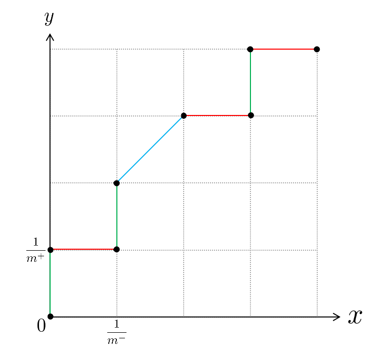
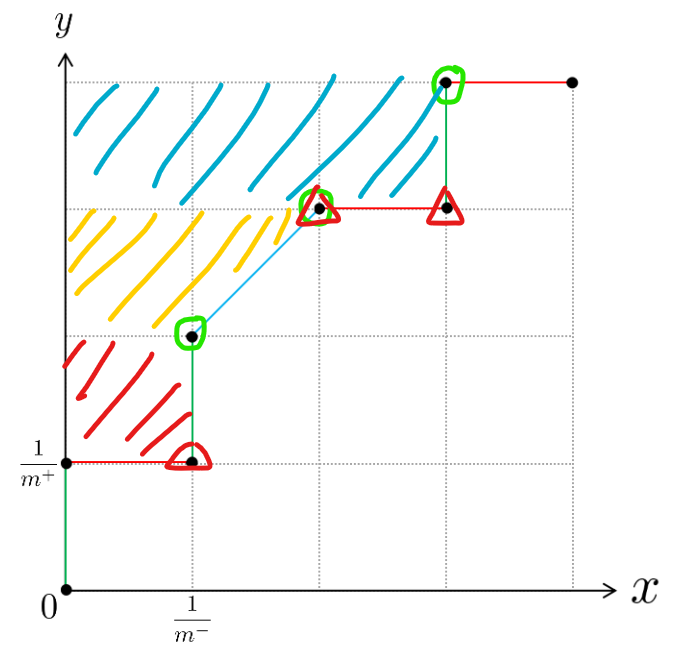

# HW2

PB20111689 蓝俊玮

## 2.2

采用 10 折交叉验证法时，则将数据集划分成 10 个互斥子集，且每次训练的时候，选其中一份作为验证集，而其它留作训练集。由于交叉验证法在采样时会通过分层采样，所以期望会得到数据仍保持分布一致性。那么就可以期望认为每个子集中都有 5 个正例和 5 个反例。那么在每轮训练中，训练集中都会期望有 45 个正例和 45 个反例，验证集中期望有 5 个正例和 5 个反例。这样预测结果就是随机的，那么期望的预测错误率就会是 50%。

采用留一法时，则相当于将数据集划分为 100 个互斥子集，实际上每个子集就是每个数据自己本身。那么在每一轮训练中，训练集中都会有 99 个数据集，而验证集只有 1 个数据。若验证集中的是正例，说明训练集中会有 49 个正例和 50 个反例，那么预测器就会以较多数量的反例作为预测结果，则验证集中预测的结果错误率就会是 100%。同理，当验证集中是反例时，说明训练集中会有 50 个正例和 49 个反例，那么预测器就会以较多数量的正例作为预测结果，则验证集中预测的结果错误率就会是 100%。因此无论是哪种情况，错误率都会是100%。

所以 10 折交叉验证法的错误率期望为 50%，而留一法的错误率就会是 100%。

## 2.4

首先给出分类结果混淆矩阵

    <table>
        <caption align="center">分类结果混淆矩阵</caption>
    	<tr>
        	<td rowspan="2" align="center">真实情况</td>
        	<td colspan="2" align="center">预测结果</td>
    	</tr>
        <tr>
            <td align="center">正例</td>
            <td align="center">反例</td>
        </tr>
        <tr>
            <td align="center">正例</td>
            <td align="center">TP(真正例)</td>
            <td align="center">FN(假反例)</td>
        </tr>
        <tr>
            <td align="center">反例</td>
            <td align="center">FP(假正例)</td>
            <td align="center">TN(真反例)</td>
        </tr>
    </table>

则可以给出真正例率(TPR)、假正例率(FPR)、查准率(P)、查全率(R)的定义
$$
TPR=\frac{TP}{TP+FN}\quad FPR=\frac{FP}{FP+TN}\\
P=\frac{TP}{TP+FP}\quad R=\frac{TP}{TP+FN}
$$
则真正例率的含义为：真正的正例被预测为正例的概率，假正例率的含义为：真正的反例被预测为正例的概率。

查准率的含义为：预测的正例为真正的正例的概率，查全率的含义为：真正的正例被预测为正例的概率

同时查准率和查全率（真正例率）之间的关系可以这样描述：如果想要挑出尽可能多的好瓜（提高查全率），那么准度可能就会下降（查准率下降）；如果想要挑出比较有把握为好瓜的瓜（提高查准率），则这样会漏掉其他的好瓜（查全率下降）。

而真正例率和假正例率存在正比关系，即当假正例率高的时候，说明预测器更倾向于将结果预测为正例，因此真正例率也会提高（因为这样漏掉的正例就会减少），同理，当预测器更倾向于将结果预测为反例时，假正例率和真正例率都会下降。

因此四者的关系可以由真正例率与查全率相等而联系起来。查准率和查全率是一对矛盾的度量，所以查准率与真正例率也是一对矛盾的度量，同时查全率还和假正例率存在正向相关的关系。至于查准率和假正例率之间并不存在太大的联系。

## 2.5

$$
l_{rank}=\frac{1}{m^+m^-}\sum\limits_{x^+\in D^+}\sum\limits_{x^-\in D^-}(\mathbb{I}(f(x^+)<f(x^-))+\frac{1}{2}\mathbb{I}(f(x^+)=f(x^-)))\\
AUC=\frac{1}{2}\sum\limits_{i=1}^{m-1}(x_{i+1}-x_i)(y_i+y_{i+1})
$$

则可以将 $l_{rank}$ 表示为 $l_{rank}=\sum\limits_{x^+\in D^+}\frac{1}{m^+}(\frac{1}{m^-}\sum\limits_{x^-\in D^-}\mathbb{I}(f(x^+)<f(x^-)))+\frac{1}{2}\sum\limits_{x^+\in D^+}\frac{1}{m^+}(\frac{1}{m^-}\sum\limits_{x^-\in D^-}\mathbb{I}(f(x^+)=f(x^-)))$

在这里，每个真正例对应于绿色线段，而既是真正例也是假正例的对应于蓝色线段，假正例对应于红色线段。由于 ROC 中的样例是根据预测结果进行排序的，同时是以降序排序的，即从左到右来看，$f(x)$ 是递减的。

接下来继续分析 $l_{rank}$，$for\ x^+_i\ in\ D^+$ 即固定 $x^+_i$，对每一个 $x_i^+$ 而言，则对应于图中绿色以及蓝色线段，对式子中的两部分分开分析，就可以对应到绿色线段和蓝色线段。

$\frac{1}{m^+}(\frac{1}{m^-}\sum\limits_{x^-\in D^-}\mathbb{I}(f(x^+)<f(x^-)))$ 中的 $\mathbb{I}(f(x^+)<f(x^-))$ 表示为：所有在该绿色线段左下方的假正例的计数个数。则 $\frac{1}{m^-}\sum\limits_{x^-\in D^-}\mathbb{I}(f(x^+)<f(x^-))$ 就可以表示为该绿色线段到 **y** 轴的距离，那么 $\frac{1}{m^+}(\frac{1}{m^-}\sum\limits_{x^-\in D^-}\mathbb{I}(f(x^+)<f(x^-)))$ 就表示该绿色线段与 **y** 轴共同围成的面积。

而对于蓝色线段也是同理的，蓝色线段需要计算两个部分，$\frac{1}{m^-}\sum\limits_{x^-\in D^-}\mathbb{I}(f(x^+)<f(x^-))$ 与上述绿色线段中的分析是一样的，它可以表示完整的 1 个罚分（即对应一个面积单元 $\frac{1}{m^+m^-}$），而 $\frac{1}{2}\sum\limits_{x^+\in D^+}\frac{1}{m^+}(\frac{1}{m^-}\sum\limits_{x^-\in D^-}\mathbb{I}(f(x^+)=f(x^-)))$ 就表示 0.5 个罚分，可以对应于三角形面积区域。（可以借助下图理解，图中红色三角表示假正例，绿色圆圈表示真正例）

所有将上述面积求和之后，就是 ROC 曲线左边（上边）部分的面积，而 AUC 面积就 ROC 曲线下的面积，所以两者之和为 1，即有 $AUC=1-l_{rank}$。

## 2.9

$\chi^2$ 检验过程可以分为适合性检验、独立性检验和同质性检验等不同类型的检验。其检验的基本步骤就是：

1. 根据检验数据类型确定检验方法

2. 提出原假设 $H_0$ 和备择假设 $H_1$ 

3. 确定显著水平 $\alpha$

4. 计算样本的 $\chi^2$ 值并查表比较

5. 进行统计推断 

