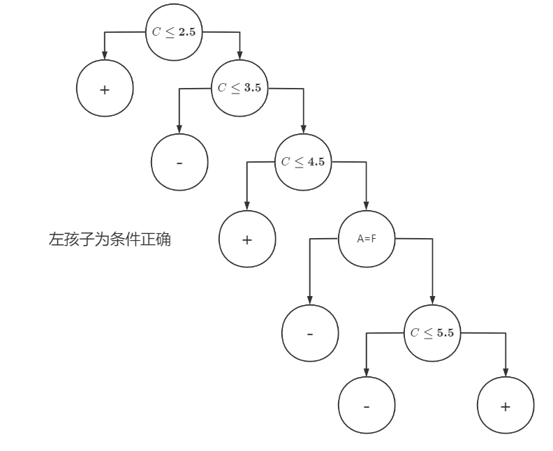
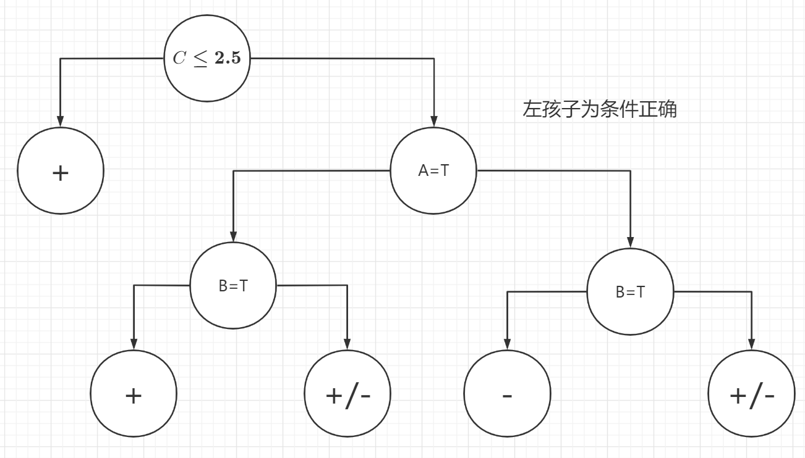

# HW4

PB20111689 蓝俊玮

## 4.1

> 试证明对于不含冲突数据（即特征向量完全相同但标记不同）的训练集，必存在与训练集一致（即训练误差为 0）的决策树

对于所有特征值都为离散的决策树来说，从根节点到叶节点上所有特征值就会构成一个特征向量。那么对于该决策树来说，因为不存在冲突数据，所以可以视为每一条路径上的特征向量都不同，那么训练集上的所有所有数据都会对应到一个叶节点。这样的话，对于每一个特征向量，最终都只有一条路径且指向其训练数据的标签上，所以必定存在与训练集一致的决策树。

对于特征值不全为离散的决策树来说，其整体原理和上述是一样的，不同的是中间节点将使用区间值表示。从决策树的基本学习算法看来，对于一个中间节点来说，在训练的过程中，如果存在两个数据的标签不同，那么这个中间节点的特征将会被进一步划分。因此和上述情况类似，当特征向量类似的两个数据将会被划分到同一个叶节点上。因此对于整个数据集来说，特征向量相同的数据只会对应到一个叶节点上。因此必定存在与训练集一致的决策树。

## 4.9

> 试将 4.4.2 节对缺失值的处理机制推广到基尼指数的计算中去

原来的基尼指数相关定义为 
$$
Gini(D)=\sum\limits_{k=1}^{|y|}\sum\limits_{k'\neq k}p_kp_{k'}=1-\sum\limits_{k=1}^{|y|}p_k^2\\
Gini\_index(D,a)=\sum\limits_{v=1}^{V}\frac{|D^v|}{|D|}Gini(D^v)
$$
则可以定义新的基尼指数为
$$
Gini(D)=\sum\limits_{k=1}^{|y|}\sum\limits_{k'\neq k}\tilde{p}_k\tilde{p}_{k'}=1-\sum\limits_{k=1}^{|y|}\tilde{p}_k^2\\
Gini\_index(D,a)=\rho\times Gini\_index(\tilde{D},a)=\rho\times\sum\limits_{v=1}^{V}\tilde{r}_vGini(\tilde{D}^v)
$$
这些新的表示变量都是课本上的定义。

## T3

> 假设离散随机变量 $X\in\{1,...,K\}$，其取值为 $k$ 的概率 $P(X=k)=p_k$，其熵为 $H(\pmb{p})=-\sum_kp_k\log_2p_k$，试用拉格朗日乘子法证明熵最大的分布为均匀分布

我们知道有 ${\sum\limits_{k=1}^{K}P(X=k)}=1$，那么使用拉格朗日乘子法有
$$
L=-\sum_{k}p_k\log_2p_k+\lambda\sum_{k}p_k-\lambda
$$
则可以推出
$$
\frac{\part L}{\part p_k}=-\log_2p_k-p_k\frac{1}{p_k}\log_2{e}+\lambda=0\\
\Rightarrow \log_2p_k=\lambda-\log_2e\\
\frac{\part L}{\part\lambda}=\sum_kp_k-1=0
$$
则很自然的可以推出
$$
p_1=p_2=p_3=...=p_K=\frac{1}{K}\\
\lambda=\log_2{\frac{e}{K}}
$$
所以这些概率都是相等的，则对于该熵的分布就是均匀分布。

## T4

### a

整个训练样本关于类属性的熵为 $Ent(D)=-\frac{5}{10}\log_2\frac{5}{10}-\frac{5}{10}\log_2\frac{5}{10}=\frac{5}{10}+\frac{5}{10}=1$

### b

$$
Gain(D,A)=Ent(D)-\frac{4}{10}\times(-\frac{3}{4}\log_2\frac{3}{4}-\frac{1}{4}\log_2\frac{1}{4})-\frac{6}{10}\times(-\frac{2}{6}\log_2\frac{2}{6}-\frac{4}{6}\log_2\frac{4}{6})=0.125\\
Gain(D,B)=Ent(D)-\frac{5}{10}\times(-\frac{2}{5}\log_2{\frac{2}{5}}-\frac{3}{5}\log_2{\frac{3}{5}})-\frac{5}{10}\times(-\frac{3}{5}\log_2{\frac{3}{5}}-\frac{2}{5}\log_2{\frac{2}{5}})=0.029
$$

### c

因为属性 C 的值都为连续值，则可以计算出所有的候选值为 $1.5,2.5,3.5,4.5,5,5.5,6.5,7,7.5$
$$
Gain(D,C,1.5)=Ent(D)-\frac{1}{10}\times(-\frac{1}{1}\log_2{1})-\frac{9}{10}\times(-\frac{4}{9}\log_2{\frac{4}{9}}-\frac{5}{9}\log_2{\frac{5}{9}})=0.108\\
Gain(D,C,2.5)=Ent(D)-\frac{2}{10}\times(-\frac{2}{2}\log_2{\frac{2}{2}})-\frac{8}{10}\times(-\frac{3}{8}\log_2{\frac{3}{8}}-\frac{5}{8}\log_2{\frac{5}{8}})=0.236\\
Gain(D,C,3.5)=Ent(D)-\frac{3}{10}\times(-\frac{2}{3}\log_2{\frac{2}{3}}-\frac{1}{3}\log_2{\frac{1}{3}})-\frac{7}{10}\times(-\frac{3}{7}\log_2{\frac{3}{7}}-\frac{4}{7}\log_2{\frac{4}{7}})=0.035\\
Gain(D,C,4.5)=Ent(D)-\frac{4}{10}\times(-\frac{3}{4}\log_2{\frac{3}{4}}-\frac{1}{4}\log_2{\frac{1}{4}})-\frac{6}{10}\times(-\frac{2}{6}\log_2{\frac{2}{6}}-\frac{4}{6}\log_2{\frac{4}{6}})=0.125\\
Gain(D,C,5)=Ent(D)-\frac{6}{10}\times(-\frac{3}{6}\log_2{\frac{3}{6}}-\frac{3}{6}\log_2{\frac{3}{6}})-\frac{4}{10}\times(-\frac{2}{4}\log_2{\frac{2}{4}}-\frac{2}{4}\log_2{\frac{2}{4}})=0\\
Gain(D,C,5.5)=Ent(D)-\frac{6}{10}\times(-\frac{3}{6}\log_2{\frac{3}{6}}-\frac{3}{6}\log_2{\frac{3}{6}})-\frac{4}{10}\times(-\frac{2}{4}\log_2{\frac{2}{4}}-\frac{2}{4}\log_2{\frac{2}{4}})=0\\
Gain(D,C,6.5)=Ent(D)-\frac{7}{10}\times(-\frac{4}{7}\log_2{\frac{4}{7}}-\frac{3}{7}\log_2{\frac{3}{7}})-\frac{3}{10}\times(-\frac{1}{3}\log_2{\frac{1}{3}}-\frac{2}{3}\log_2{\frac{2}{3}})=0.035\\
Gain(D,C,7)=Ent(D)-\frac{9}{10}\times(-\frac{5}{9}\log_2{\frac{5}{9}}-\frac{4}{9}\log_2{\frac{4}{9}})-\frac{1}{10}\times(-\frac{1}{1}\log_21)=0.108\\
Gain(D,C,7.5)=Ent(D)-\frac{9}{10}\times(-\frac{5}{9}\log_2{\frac{5}{9}}-\frac{4}{9}\log_2{\frac{4}{9}})-\frac{1}{10}\times(-\frac{1}{1}\log_21)=0.108\\
$$

### d

根据 Gini 指数 
$$
Gini(D)=\sum\limits_{k=1}^{|y|}\sum\limits_{k'\neq k}p_kp_{k'}=1-\sum\limits_{k=1}^{|y|}p_k^2\\
Gini\_index(D,a)=\sum\limits_{v=1}^{V}\frac{|D^v|}{|D|}Gini(D^v)
$$
那么计算出 
$$
Gini\_index(D,A)=\frac{4}{10}\times(1-(\frac{3}{4})^2-(\frac{1}{4})^2)+\frac{6}{10}\times(1-(\frac{2}{6})^2-(\frac{4}{6})^2)=\frac{5}{12}\\
Gini\_index(D,B)=\frac{5}{10}\times(1-(\frac{2}{5})^2-(\frac{3}{5})^2)+\frac{5}{10}\times(1-(\frac{3}{5})^2-(\frac{2}{5})^2)=\frac{12}{25}
$$
计算出来的结果是 $Gini\_index(D,A)<Gini\_index(D,B)$，所以选择属性 A 作为最优划分属性。

### e

这里存在分歧的原因是在于 C4.5 算法中并没有给出关于连续值处理的问题，而且也没有明确的指出需要在每次划分出最优属性后，将该属性除去属性集合中。因此我给出了两种方案下的计算结果：

首先计算出
$$
IV(A)=-\frac{4}{10}\log_2{\frac{4}{10}}-\frac{6}{10}\log_2{\frac{6}{10}}=0.971\\
IV(B)=-\frac{5}{10}\log_2{\frac{5}{10}}-\frac{5}{10}\log_2{\frac{5}{10}}=1\\
$$
则第一步计算得到 
$$
Gain\_ratio(D,A)=\frac{Gain(D,A)}{IV(A)}=\frac{0.125}{0.971}=0.129\\
Gain\_ratio(D,B)=\frac{Gain(D,B)}{IV(B)}=\frac{0.029}{1}=0.029\\
IV(C)=-\frac{2}{10}\log_2{\frac{2}{10}}-\frac{8}{10}\log_2{\frac{8}{10}}=0.722\\
Gain\_ratio(D,C)=\frac{Gain(D,C)}{IV(C)}=\frac{0.236}{0.722}=0.327
$$
而这下得到的 $C\le2.5$ 的一侧预测值都设为 $+$，重新计算 $A,B,C$ 的信息增益率：
$$
Ent(D_1)=-\frac{3}{8}\log_2{\frac{3}{8}}-\frac{5}{8}\log_2{\frac{5}{8}}=0.954\\
Gain(D_1,A)=Ent(D_1)-\frac{3}{8}\times(-\frac{2}{3}\log_2{\frac{2}{3}}-\frac{1}{3}\log_2{\frac{1}{3}})-\frac{5}{8}\times(-\frac{1}{5}\log_2{\frac{1}{5}}-\frac{4}{5}\log_2{\frac{4}{5}})=0.158\\
Gain(D_1,B)=Ent(D_1)-\frac{4}{8}\times(-\frac{1}{4}\log_2{\frac{1}{4}}-\frac{3}{4}\log_2{\frac{3}{4}})-\frac{4}{8}\times(-\frac{2}{4}\log_2{\frac{2}{4}}-\frac{2}{4}\log_2{\frac{2}{4}})=0.048\\
IV(A)=-\frac{3}{8}\log_2{\frac{3}{8}}-\frac{5}{8}\log_2{\frac{5}{8}}=0.954\\
IV(B)=-\frac{4}{8}\log_2{\frac{4}{8}}-\frac{4}{8}\log_2{\frac{4}{8}}=1\\
Gain\_ratio(D_1,A)=\frac{Gain(D_1,A)}{IV(A)}=\frac{0.158}{0.954}=0.166\\
Gain\_ratio(D_1,B)=\frac{Gain(D_1,B)}{IV(B)}=\frac{0.048}{1}=0.048\\
$$
现在 C 的候选值有 $3.5,4.5,5,5.5,6.5,7,7.5$ 
$$
Gain(D_1,C,3.5)=Ent(D_1)-\frac{1}{8}\times(-\frac{1}{1}\log_2{\frac{1}{1}})-\frac{7}{8}\times(-\frac{3}{7}\log_2{\frac{3}{7}}-\frac{4}{7}\log_2{\frac{4}{7}})=0.092\\
Gain(D_1,C,4.5)=Ent(D_1)-\frac{2}{8}\times(-\frac{1}{2}\log_2{\frac{1}{2}}-\frac{1}{2}\log_2{\frac{1}{2}})-\frac{6}{8}\times(-\frac{2}{6}\log_2{\frac{2}{6}}-\frac{4}{6}\log_2{\frac{4}{6}})=0.015\\
Gain(D_1,C,5)=Ent(D_1)-\frac{4}{8}\times(-\frac{1}{4}\log_2{\frac{1}{4}}-\frac{3}{4}\log_2{\frac{3}{4}})-\frac{4}{8}\times(-\frac{2}{4}\log_2{\frac{2}{4}}-\frac{2}{4}\log_2{\frac{2}{4}})=0.048\\
Gain(D_1,C,5.5)=Ent(D_1)-\frac{4}{8}\times(-\frac{1}{4}\log_2{\frac{1}{4}}-\frac{3}{4}\log_2{\frac{3}{4}})-\frac{4}{8}\times(-\frac{2}{4}\log_2{\frac{2}{4}}-\frac{4}{4}\log_2{\frac{4}{4}})=0.048\\
Gain(D_1,C,6.5)=Ent(D_1)-\frac{5}{8}\times(-\frac{2}{5}\log_2{\frac{2}{5}}-\frac{3}{5}\log_2{\frac{3}{5}})-\frac{3}{8}\times(-\frac{1}{3}\log_2{\frac{1}{3}}-\frac{2}{3}\log_2{\frac{2}{3}})=0.003\\
Gain(D_1,C,7)=Ent(D_1)-\frac{7}{8}\times(-\frac{3}{7}\log_2{\frac{3}{7}}-\frac{4}{7}\log_2{\frac{4}{7}})-\frac{1}{8}\times(-\frac{1}{1}\log_2{\frac{1}{1}})=0.092\\
Gain(D_1,C,7.5)=Ent(D_1)-\frac{7}{8}\times(-\frac{3}{7}\log_2{\frac{3}{7}}-\frac{4}{7}\log_2{\frac{4}{7}})-\frac{1}{8}\times(-\frac{1}{1}\log_2{\frac{1}{1}})=0.092\\
$$
则有
$$
IV(C)=-\frac{1}{8}\log_2{\frac{1}{8}}-\frac{7}{8}\log_2{\frac{7}{8}}=0.544\\
Gain\_ratio(D_1,C)=\frac{Gain(D_1,C)}{IV(C)}=\frac{0.092}{0.544}=0.169
$$
则得到 $C\le 3.5$
$$
Ent(D_2)=-\frac{3}{7}\log_2{\frac{3}{7}}-\frac{4}{7}\log_2{\frac{4}{7}}=0.985\\
Gain(D_2,A)=Ent(D_2)-\frac{3}{7}\times(-\frac{2}{3}\log_2{\frac{2}{3}}-\frac{1}{3}\log_2{\frac{1}{3}})-\frac{4}{7}\times(-\frac{1}{4}\log_2{\frac{1}{4}}-\frac{3}{4}\log_2{\frac{3}{4}})=0.128\\
Gain(D_2,B)=Ent(D_2)-\frac{3}{7}\times(-\frac{1}{3}\log_2{\frac{1}{3}}-\frac{2}{3}\log_2{\frac{2}{3}})-\frac{4}{7}\times(-\frac{2}{4}\log_2{\frac{2}{4}}-\frac{2}{4}\log_2{\frac{2}{4}})=0.020\\
IV(A)=-\frac{3}{7}\log_2{\frac{3}{7}}-\frac{4}{7}\log_2{\frac{4}{7}}=0.985\\
IV(B)=-\frac{3}{7}\log_2{\frac{3}{7}}-\frac{4}{7}\log_2{\frac{4}{7}}=0.985\\
Gain\_ratio(D_2,A)=\frac{Gain(D_2,A)}{IV(A)}=\frac{0.128}{0.954}=0.134\\
Gain\_ratio(D_2,B)=\frac{Gain(D_2,B)}{IV(B)}=\frac{0.020}{1}=0.020\\
$$

现在 C 的候选值有 $4.5,5,5.5,6.5,7,7.5$ 
$$
Gain(D_2,C,4.5)=Ent(D_2)-\frac{1}{7}\times(-\frac{1}{1}\log_2{\frac{1}{1}})-\frac{6}{7}\times(-\frac{2}{6}\log_2{\frac{2}{6}}-\frac{4}{6}\log_2{\frac{4}{6}})=0.198\\
Gain(D_2,C,5)=Ent(D_2)-\frac{3}{7}\times(-\frac{1}{3}\log_2{\frac{1}{3}}-\frac{2}{3}\log_2{\frac{2}{3}})-\frac{4}{7}\times(-\frac{2}{4}\log_2{\frac{2}{4}}-\frac{2}{4}\log_2{\frac{2}{4}})=0.020\\
Gain(D_2,C,5.5)=Ent(D_2)-\frac{3}{7}\times(-\frac{1}{3}\log_2{\frac{1}{3}}-\frac{2}{3}\log_2{\frac{2}{3}})-\frac{4}{7}\times(-\frac{2}{4}\log_2{\frac{2}{4}}-\frac{2}{4}\log_2{\frac{2}{4}})=0.020\\
Gain(D_2,C,6.5)=Ent(D_2)-\frac{4}{7}\times(-\frac{2}{4}\log_2{\frac{2}{4}}-\frac{2}{4}\log_2{\frac{2}{4}})-\frac{3}{7}\times(-\frac{1}{3}\log_2{\frac{1}{3}}-\frac{2}{3}\log_2{\frac{2}{3}})=0.020\\
Gain(D_2,C,7)=Ent(D_2)-\frac{6}{7}\times(-\frac{3}{6}\log_2{\frac{3}{6}}-\frac{3}{6}\log_2{\frac{3}{6}})-\frac{1}{7}\times(-\frac{1}{1}\log_2{\frac{1}{1}})=0.127\\
Gain(D_2,C,7.5)=Ent(D_2)-\frac{6}{7}\times(-\frac{3}{6}\log_2{\frac{3}{6}}-\frac{3}{6}\log_2{\frac{3}{6}})-\frac{1}{7}\times(-\frac{1}{1}\log_2{\frac{1}{1}})=0.127\\
$$
则有
$$
IV(C)=-\frac{1}{7}\log_2{\frac{1}{7}}-\frac{6}{7}\log_2{\frac{6}{7}}=0.592\\
Gain\_ratio(D_2,C)=\frac{Gain(D_2,C)}{IV(C)}=\frac{0.198}{0.592}=0.334
$$
则有 $C\le 4.5$
$$
Ent(D_3)=-\frac{2}{6}\log_2{\frac{2}{6}}-\frac{4}{6}\log_2{\frac{4}{6}}=0.918\\
Gain(D_3,A)=Ent(D_3)-\frac{3}{6}\times(-\frac{2}{3}\log_2{\frac{2}{3}}-\frac{1}{3}\log_2{\frac{1}{3}})-\frac{3}{6}\times(-\frac{3}{3}\log_2{\frac{3}{3}})=0.459\\
Gain(D_3,B)=Ent(D_3)-\frac{3}{6}\times(-\frac{1}{3}\log_2{\frac{1}{3}}-\frac{2}{3}\log_2{\frac{2}{3}})-\frac{3}{6}\times(-\frac{1}{3}\log_2{\frac{1}{3}}-\frac{2}{3}\log_2{\frac{2}{3}})=0\\
IV(A)=-\frac{3}{6}\log_2{\frac{3}{6}}-\frac{3}{6}\log_2{\frac{3}{6}}=1\\
IV(B)=-\frac{3}{6}\log_2{\frac{3}{6}}-\frac{3}{6}\log_2{\frac{3}{6}}=1\\
Gain\_ratio(D_3,A)=\frac{Gain(D_3,A)}{IV(A)}=\frac{0.459}{1}=0.459\\
Gain\_ratio(D_3,B)=\frac{Gain(D_3,B)}{IV(B)}=\frac{0}{1}=0\\
$$
现在 C 的候选值有 $5,5.5,6.5,7,7.5$ 
$$
Gain(D_3,C,5)=Ent(D_3)-\frac{2}{6}\times(-\frac{2}{2}\log_2{\frac{2}{2}})-\frac{4}{6}\times(-\frac{2}{4}\log_2{\frac{2}{4}}-\frac{2}{4}\log_2{\frac{2}{4}})=0.251\\
Gain(D_3,C,5.5)=Ent(D_3)-\frac{2}{6}\times(-\frac{2}{2}\log_2{\frac{2}{2}})-\frac{4}{6}\times(-\frac{2}{4}\log_2{\frac{2}{4}}-\frac{2}{4}\log_2{\frac{2}{4}})=0.251\\
Gain(D_3,C,6.5)=Ent(D_3)-\frac{3}{6}\times(-\frac{1}{3}\log_2{\frac{1}{3}}-\frac{2}{3}\log_2{\frac{2}{3}})-\frac{3}{6}\times(-\frac{1}{3}\log_2{\frac{1}{3}}-\frac{2}{3}\log_2{\frac{2}{3}})=0\\
Gain(D_3,C,7)=Ent(D_3)-\frac{5}{6}\times(-\frac{2}{5}\log_2{\frac{2}{5}}-\frac{3}{5}\log_2{\frac{3}{5}})-\frac{1}{6}\times(-\frac{1}{1}\log_2{\frac{1}{1}})=0.109\\
Gain(D_3,C,7.5)=Ent(D_3)-\frac{5}{6}\times(-\frac{2}{5}\log_2{\frac{2}{5}}-\frac{3}{5}\log_2{\frac{3}{5}})-\frac{1}{6}\times(-\frac{1}{1}\log_2{\frac{1}{1}})=0.109\\
$$
则有
$$
IV(C)=-\frac{2}{6}\log_2{\frac{2}{6}}-\frac{4}{6}\log_2{\frac{4}{6}}=0.918\\
Gain\_ratio(D_3,C)=\frac{Gain(D_3,C)}{IV(C)}=\frac{0.251}{0.918}=0.273
$$
则得到 $A=F$
$$
Ent(D_4)=-\frac{2}{3}\log_2{\frac{2}{3}}-\frac{1}{3}\log_2{\frac{1}{3}}=0.918\\
Gain(D_4,A)=Ent(D_4)-\frac{3}{3}\times(-\frac{2}{3}\log_2{\frac{2}{3}}-\frac{1}{3}\log_2{\frac{1}{3}})=0\\
Gain(D_4,B)=Ent(D_4)-\frac{1}{3}\times(-\frac{1}{1}\log_2{\frac{1}{1}})-\frac{2}{3}\times(-\frac{1}{2}\log_2{\frac{1}{2}}-\frac{1}{2}\log_2{\frac{1}{2}})=0.251\\
IV(B)=-\frac{1}{3}\log_2{\frac{1}{3}}-\frac{2}{3}\log_2{\frac{2}{3}}=0.918\\
Gain\_ratio(D_4,A)=0\\
Gain\_ratio(D_4,B)=\frac{Gain(D_4,B)}{IV(B)}=\frac{0.251}{0.918}=273\\
$$
现在 C 的候选值有 $5.5,6.5$
$$
Gain(D_4,C,5.5)=Ent(D_4)-\frac{1}{3}\times(-\frac{1}{1}\log_2{\frac{1}{1}})-\frac{2}{3}\times(-\frac{2}{2}\log_2{\frac{2}{2}})=0.918\\
Gain(D_4,C,6.5)=Ent(D_4)-\frac{2}{3}\times(-\frac{1}{2}\log_2{\frac{1}{2}}-\frac{1}{2}\log_2{\frac{1}{2}})-\frac{1}{3}\times(-\frac{1}{1}\log_2{\frac{1}{1}})=0.251\\
$$
则有
$$
IV(C)=-\frac{1}{3}\log_2{\frac{1}{3}}-\frac{2}{3}\log_2{\frac{2}{3}}=0.918\\
Gain\_ratio(D_4,C)=\frac{Gain(D_4,C)}{IV(C)}=\frac{0.918}{0.918}=1
$$
则得到 $C\le5.5$。至此，决策树构造完成。

如果采用的是课本上的决策树学习基本算法，每次划分完之后要去掉该最优属性，那么就有：

