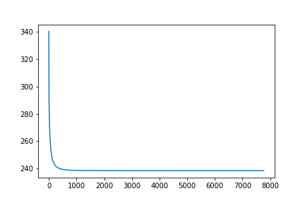

# Lab 1 实验报告

PB20111689 蓝俊玮 		实验环境为 Goggle Colab 		实验数据为 [Loan Data Set | Kaggle](https://www.kaggle.com/datasets/burak3ergun/loan-data-set)

## 数据处理

`Loan.csv` 中的特征数据有 `Loan_ID`，`Gender`，`Married`，`Dependents`，`Education`，`Self_Employed`，`ApplicantIncome`，`CoapplicantIncome`，`LoanAmonut`，`Loan_Amount_Term`，`Credit_History`，`Property_Area` 和 `Loan_Status`。因为 `Loan_ID` 和数据集的预测结果没有任何关系，所有可以将 `Loan_ID` 从数据集中除去。

由于数据中某些特征的值可能为空值，所以我采取两种方法进行处理。第一种方法是除去所有含有空值的数据，即只保留所有特征均不为空值的数据，第二种方法是将空缺的特征用相邻数据的特征填补，使数据集能够保持完整性。

将数据处理完之后，为数据集添加上 `Bias` 特征，即将输入向量和权重扩充成 $\hat{\pmb{x}}=(\pmb{x};1)$ 和 $\hat{\pmb{w}}=(\pmb{w};b)$

将这些数据预处理之后，然后将数据的特征转化成数值特征，即对这些非数值特征进行编码。

```python
def encodingFeatures(dataset):
    dataset.Gender = dataset.Gender.map({'Female': 0, 'Male': 1})
    dataset.Married = dataset.Married.map({'No': 0, 'Yes': 1})
    dataset.Dependents = dataset.Dependents.map({'0': 0, '1': 1, '2': 2, '3+': 3})
    dataset.Education = dataset.Education.map({'Not Graduate': 0, 'Graduate': 1})
    dataset.Self_Employed = dataset.Self_Employed.map({'No': 0, 'Yes': 1})
    dataset.Property_Area = dataset.Property_Area.map({'Rural': 0, 'Semiurban': 1, 'Urban': 2})
    dataset.Loan_Status = dataset.Loan_Status.map({'N': 0, 'Y': 1})
```

编码完之后，原来的数值特征的取值范围相较来说非常大，会导致使用梯度下降法的时候，梯度的等高线会非常陡峭，导致算法比较难收敛，所以需要对其进行归一化。这里只对这几个特征进行归一化：

```python
def featuresNorm(dataset):
    dataset.ApplicantIncome /= np.linalg.norm(dataset.ApplicantIncome)
    dataset.CoapplicantIncome /= np.linalg.norm(dataset.CoapplicantIncome)
    dataset.LoanAmount /= np.linalg.norm(dataset.LoanAmount)
    dataset.Loan_Amount_Term /= np.linalg.norm(dataset.Loan_Amount_Term)
```

## 数据划分

数据划分主要采用的方法是多次留出法取平均

```python
def datasetSplit(dataset, frac, random_state):
    # 采用随机取样
    # 设置 random_state 是为了确保每次抽样都能得到相同的随机样本
    dataset_train = dataset.sample(frac=frac, random_state=random_state)
    dataset_test = dataset[~dataset.index.isin(dataset_train.index)]
    X_train = dataset_train.drop('Loan_Status', axis=1, inplace=False)
    Y_train = dataset_train.Loan_Status
    X_test = dataset_test.drop('Loan_Status', axis=1, inplace=False)
    Y_test = dataset_test.Loan_Status
    return X_train, Y_train, X_test, Y_test
```

然后通过不同的 `random_state` 进行划分数据集，以获得不同的数据集。

## 数据训练

数据训练采用的是梯度下降法，模型的损失定义为课本上定义的所需进行优化的目标值 $l(\pmb{\beta})=\sum_\limits{i=1}^{m}(-y_i\pmb{\beta}^T\hat{\pmb{x_i}}+\ln(1+e^{\pmb{\beta}^T\hat{\pmb{x_i}}}))\quad(3.27)$

```python
def fit(self, X, y, lr=0.01, tol=1e-7, max_iter=1e7):
    """
    Fit the regression coefficients via gradient descent or other methods 
    """
    y = np.expand_dims(y, axis=1)

    for iteration in range(int(max_iter)):
        p = self.sigmoid(np.dot(X, self.weights))
        if self.penalty == 'l2':
            grad = - np.dot(X.T, y - p) + self.weights
        elif self.penalty == 'l1':
            l1 = np.ones_like(self.weights)
            l1[np.where(self.weights < 0)] = 0
            grad = - np.dot(X.T, y - p) + l1

        los = (-np.dot(np.dot(y.T, X), self.weights) + np.sum(np.log(1 + np.exp(np.dot(X, self.weights)))))
        self.train_loss.append(los[0][0])

        if (np.absolute(grad) < tol).all():
            print(iteration)
            break

        self.weights = self.weights - lr * grad

```

## 模型对比

以 l2、lr=0.001、归一化、预测阈值为0.5 作为基准、其他没有列出的值视为与其相等，可以得到该表

|           平均准确率           | l2、lr=0.001、归一化、预测阈值为0.5 |  l1   | lr=0.05 | 没有归一化 | 预测阈值非0.5 |
| :----------------------------: | :---------------------------------: | :---: | :-----: | :--------: | :-----------: |
| 除去空值的数据集（5次取平均）  |                0.808                | 0.808 |  0.646  |   0.442    |     0.788     |
| 填补空值的数据集（10次取平均） |                0.809                |       |         |            |     0.772     |

在对模型进行预测的时候，出现过的最高准确率为 `0.846`，是在填补空值的数据集上，正则项为 `l2`，学习率为 `0.001`，数据进行了归一化处理，预测阈值为 `0.5`，数据集划分时随机种子为 `3407` 时出现的，这个随机数种子是听其他同学推荐的。

其中这里的 `lr=0.05` 和 `没有归一化` 的预测结果我认为是不够好的，原因在于，通过其损失函数的变化可以看出，它们并没有得到一个很好的训练结果。

这是在第一个填补空值的数据集上训练得到的损失函数曲线


