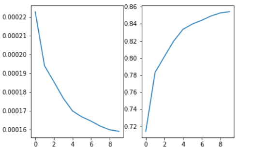

# Lab3 XGBoost 实验报告

PB20111689 蓝俊玮		实验环境：Google Colab

## 实验原理

### XGBoost

XGBoost 是由多个基模型组成的一个加法模型，假设第 $k$ 个基本模型是 $f_k(x)$ , 那么前 $t$ 个模型组成的模型的输出为：
$$
\hat{y}_i^{(t)}=\sum\limits_{k=1}^{t}f_k(x_i)=\hat{y}_i^{(t-1)}+f_t(x_i)
$$
其中 $x_i$ 为第表示第 $i$ 个训练样本，$y_i$ 表示第 $i$ 个样本的真实标签； $\hat{y}_i^{(t)}$ 表示前 $t$ 个模型对第 $i$ 个样本的标签最终预测值。

在学习第 $t$ 个基模型时，XGBoost 要优化的目标函数：（由于依次学习每个基模型，所以当学习第 $t$ 个基模型时，前 $t-1$ 个基模型是固定的，其 $penalty$ 是常数。）
$$
Obj^{(t)}=\sum\limits_{i=1}^{n}loss(y_i,\hat{y}_i^{(t)})+\sum\limits_{k=1}^{t}penalty(f_k)\\
=\sum\limits_{i=1}^{n}loss(y_i,\hat{y}_i^{(t-1)}+f_t(x_i))+\sum\limits_{k=1}^{t}penalty(f_k)\\
=\sum\limits_{i=1}^{n}loss(y_i,\hat{y}_i^{(t-1)}+f_t(x_i))+penalty(f_t)+constant
$$
其中 $n$ 表示训练样本的数量，$penalty(f_k)$ 表示对第 $k$ 个模型的复杂度的惩罚项。$loss(y_i,\hat{y}_i^{(t)}) $表示损失函数。

将 $loss(y_i,\hat{y}_i^{(t-1)}+f_t(x_i))$ 在 $\hat{y}_i^{t-1}$ 处泰勒展开可以得到：
$$
loss(y_i,\hat{y}_i^{(t-1)}+f_t(x_i))\approx loss(y_i,\hat{y}_i^{(t-1)})+g_if_t(x_i)+\frac{1}{2}h_if_t^2(x_i)
$$
其中 $g_i=\frac{\part loss(y_i,\hat{y}_i^{(t-1)})}{\part \hat{y}_i^{(t-1)}}$，$h_i=\frac{\part^2 loss(y_i,\hat{y}_i^{t-1})}{\part( \hat{y}_i^{t-1})^2}$，即 $g_i$ 为一阶导数，$h_i$ 为二阶导数。

此时的优化目标变为
$$
Obj^{(t)}=\sum\limits_{i=1}^{n}[loss(y_i,\hat{y}_i^{(t-1)})+g_if_t(x_i)+\frac{1}{2}h_if_t^2(x_i)]+penalty(f_t)+constant
$$
去掉常数项 $loss(y_i,\hat{y}_i^{(t-1)})$ （学习第 $t$ 个模型时候，$loss(y_i,\hat{y}_i^{(t-1)})$ 是一个固定值）和常数 $constant$ 后，可以得到目标函数为：
$$
Obj^{(t)}=\sum\limits_{i=1}^{n}[g_if_t(x_i)+\frac{1}{2}h_if_t^2(x_i)]+penalty(f_t)
$$
所以在学习第 $t$ 个基学习器（回归树）的时候，可以利用上式作为目标函数来进行学习。

### 回归树

在这里假设回归树有 $T$ 个叶子节点，每个叶子节点对应有一个权重。回归树模型就是将输入 $x_i$ 映射到某个叶子节点，回归树模型的输出就是这个叶子节点的权重。即 $f(x_i)=w_{q(x_i)}$，$w$ 是一个要学的 $T$ 维的向量，其中 $q(x_i)$ 表示把输入 $x_i$ 映射到的叶子节点的索引。例如：$q(x_i)=3$，那么模型输出第三个叶子节点的权重，即 $f(x_i)=w_{q(x_i)}=w_3$。

我们对某一颗回归树，他的惩罚为：
$$
penalty(f)=\gamma\cdot T+\frac{1}{2}\lambda\cdot||w||^2
$$
其中 $\gamma,\lambda$ 是我们可以调整的超参数，$T$ 为叶子数，$w$ 为权重向量。

当树的结构确定时，我们讲分配到第 $j$ 个叶子节点的样本用 $I_j$ 表示，即 $I_j=\{i|q(x_i)=j\}\ (1\le j\le T)$

由前面可知：
$$
Obj^{(t)}=\sum\limits_{i=1}^{n}[g_if_t(x_i)+\frac{1}{2}h_if_t^2(x_i)]+penalty(f_t)\\
=\sum\limits_{i=1}^{n}[g_iw_{q(x_i)}+\frac{1}{2}h_iw_{q(x_i)}^2]+\gamma\cdot T+\frac{1}{2}\lambda\cdot||w||^2\\
=\sum\limits_{j=1}^{T}[(\sum\limits_{i\in I_j}g_i)\cdot w_j+\frac{1}{2}(\sum\limits_{i\in I_j}h_i+\lambda)\cdot w_j^2]+\gamma\cdot T
$$
因为实验中的数据对应的是**回归问题**，因此可以选择损失函数为**平方损失函数**：
$$
loss(y_i,\hat{y}_i^{(t-1)})=(y_i-\hat{y}_i^{(t-1)})^2
$$
则可以计算得到：
$$
g_i=\frac{\part loss(y_i,\hat{y}_i^{(t-1)})}{\part \hat{y}_i^{(t-1)}}=-2(y_i-\hat{y}_i^{(t-1)})\\
h_i=\frac{\part^2 loss(y_i,\hat{y}_i^{t-1})}{\part( \hat{y}_i^{t-1})^2}=2
$$
为了表达简单，简记 $G_j=\sum\limits_{i\in I_j}g_j,\ H_j=\sum\limits_{i\in I_j}h_i$ 则有：
$$
Obj^{(t)}=\sum\limits_{j=1}^{T}[G_jw_j+\frac{1}{2}(H_j+\lambda)\cdot w_j^2]+\gamma\cdot T
$$
对 $w_j$ 进行优化，则求导可以得到：
$$
\frac{\part Obj^{(t)}}{\part w_j}=G_j+(H_j+\lambda)w_j=0\\
\Rightarrow w_j=-\frac{G_j}{H_j+\lambda}
$$
那么重写 $Obj^{(t)}$ 可以得到：
$$
Obj^{(t)}=\sum\limits_{j=1}^{T}[G_j(-\frac{G_j}{H_j+\lambda})+\frac{1}{2}(H_j+\lambda)(-\frac{G_j}{H_j+\lambda})^2]+\gamma T=-\frac{1}{2}\sum\limits_{j=1}^{T}\frac{G_j^2}{H_j+\lambda}+\gamma T
$$

## 模型实现

### 回归树的划分策略

为了得到第 $t$ 个回归树：

1. 在初始情况下，将所有的训练样本 $x_i$ 都划分到根节点，然后从根节点开始递归划分出叶子节点。

2. 根据划分前后的收益：

   - 划分前该节点的得分：$Obj_1=-\frac{1}{2}\frac{G^2}{H+\lambda}+\gamma$

   - 划分后左右子节点的得分和：$Obj_2=-\frac{1}{2}[\frac{G_L^2}{H_L+\lambda}+\frac{G_R^2}{H_R+\lambda}]+2\gamma$

   - 划分前后的收益为：$gain=Obj_1-Obj_2=\frac{1}{2}(\frac{G_L^2}{H_L+\lambda}+\frac{G_R^2}{H_R+\lambda}-\frac{G}{H+\lambda})-\gamma$

3. 选择最大的收益进行划分。

选择最大增益的过程如下：

1. 选出所有可以用来划分的特征集合 $\mathcal{F}$；
2. `for feature in` $\mathcal{F}$:
3.   将节点分配到的样本的特征 `feature` 提取出来，记作 `f_value_list`
4.   `for f_value in f_value_list` ：
5. ​    在特征 `feature` 上按照 `f_value` 为临界点将样本划分为左右两个集合
6. ​    计算划分后的增益
7. 返回最大的增益所对应的 `feature` 和 `f_value`

这里我认为助教提出的排序并不是必须的，因为这些 `f_value` 都是需要遍历的。 

```python
def getBestSplit(self, train_X, train_y, pred_y, depth): 
    nums, features = np.shape(train_X)	# 选出所有可以用来划分的特征集合
    max_gain = float("-inf")
    obj1 = self.Obj(train_y, pred_y)	# 划分前该节点的得分
    best_feature, best_f_value = 0, 0
    for feature in range(features):
        f_values_list = set(train_X[:, feature].T.tolist())	# 将节点分配到的样本的特征提取出来
        for f_value in f_values_list:
            split_train_X, split_train_y, split_pred_y = self.splitTree(train_X, train_y, pred_y, feature, f_value)	# 在特征 `feature` 上按照 `f_value` 为临界点将样本划分为左右两个集合
            obj2 = self.Obj(split_train_y[0], split_pred_y[0]) + self.Obj(split_train_y[1], split_pred_y[1]) 
            gain = obj1 - obj2 		# 划分前后的收益
            if gain > max_gain:		# 选择最大的收益进行划分
                max_gain = gain
                best_feature = feature
                best_f_value = f_value
    return best_feature, best_f_value	# 返回最大的增益所对应的 `feature` 和 `f_value`
```

### 回归树的划分停止策略

在回归树中划分节点时，我采用了这些策略来进行提前停止划分：

- 划分后增益小于某个阈值则停止划分（默认设置不存在）；

  ```python
  if self.gain_threshold is not None and max_gain <= self.gain_threshold:
      return None, self.getLeafWeight(train_y, pred_y)
  ```

- 划分后树的深度大于某个阈值停止划分（默认设置存在）；

  ```python
  if depth >= self.max_depth:
      return None, self.getLeafWeight(train_y, pred_y)
  ```

- 该节点分配到的样本数目小于某个阈值停止划分（默认设置不存在）；

  ```python
  if self.tree_threshold is not None and len(set(train_y.T.tolist())) <= self.tree_threshold:
      return None, self.getLeafWeight(train_y, pred_y)
  ```

而在 XGBoost 学习过程中，我只采用了一种策略来提前停止学习：

- 学习 `model_num` 个回归树后停止学习（默认设置存在）；

### 回归树的数据结构

在得到这个最大增益所对应的 `feature` 和 `f_value` 之后，就可以构建我们的回归树，为了构建回归树，使用一个二叉树的数据结构来存储每个节点的信息：

```python
class Tree:
    def __init__(self, feature, f_value):
        self.feature = feature
        self.f_value = f_value
        self.left_tree = None
        self.right_tree = None
```

其中使用 `feature` 字段来存储当前节点所对应的特征划分（当这个特征为 `None` 时，说明该节点为叶子节点），使用 `f_value` 字段来存储当前节点所对应的特征的值（当特征为 `None` 时，说明该节点为叶子节点，则 `f_value` 存储的是叶子的**权重**，而不再是特征的值），并且认为左子树的 `f_value` 小于等于该父节点，而右子树的 `f_value` 是大于该父节点的。

### 回归树的建树过程

构建回归树的时候，初始情况下，将所有的样本都分配到根节点，通过 `getBestSplit` 选择当前所能选择的最佳划分，将当前节点所有的样本分配到左子树和右子树中。然后采用递归的方式继续构建回归树，分别对左子树和右子树进行递归构建。

```python
def buildTree(self, train_X, train_y, pred_y, depth):
    feature, f_value = self.getBestSplit(train_X, train_y, pred_y, depth)	# 选择最大的增益所对应的特征和值
    if feature is None:		# 如果当前节点是叶子节点，则不再划分
        return Tree(feature, f_value)
    tree = Tree(feature, f_value)
    # 根据最大增益所对应的特征和值划分得到左右子树
    split_train_X, split_train_y, split_pred_y = self.splitTree(train_X, train_y, pred_y, feature, f_value)
	# 对左子树和右子树递归构建回归树
    tree.left_tree = self.buildTree(split_train_X[0], split_train_y[0], split_pred_y[0], depth + 1)
    tree.right_tree = self.buildTree(split_train_X[1], split_train_y[1], split_pred_y[1], depth + 1)
    return tree
```

### XGBoost 学习过程

我们知道，XGBoost 是由多个基模型组成的一个加法模型，假设第 $k$ 个基本模型是 $f_k(x)$ , 那么前 $t$ 个模型组成的模型的输出为：
$$
\hat{y}_i^{(t)}=\sum\limits_{k=1}^{t}f_k(x_i)=\hat{y}_i^{(t-1)}+f_t(x_i)
$$
其中 $x_i$ 为第表示第 $i$ 个训练样本，$y_i$ 表示第 $i$ 个样本的真实标签； $\hat{y}_i^{(t)}$ 表示前 $t$ 个模型对第 $i$ 个样本的标签最终预测值。在学习第 $t$ 个基学习器（回归树）的时候，目标函数为：
$$
Obj^{(t)}=\sum\limits_{i=1}^{n}[g_if_t(x_i)+\frac{1}{2}h_if_t^2(x_i)]+penalty(f_t)
$$
可以看出，再每一轮学习的过程中，都需要使用到以往经验中的 $\hat{y}^{(t-1)}$，因此我们需要维护预测值 $\hat{y}$，并且在每一轮学习的过程中，都需要将其传入到第 $t$ 个回归树中，以便于回归树从以往的经验中学习得到一个模型。因此使用 `pred_y` 来维护预测值 $\hat{y}$。

```python
def fit(self, train_X, train_y, pred_y):	# pred_y 初始全为 0
    nums, features = train_X.shape
    for _ in range(self.model_num):		# 总共学习 model_num 个回归树
        base_model = ReregssionTree(self.gamma, self.lambda0, self.max_depth, self.gain_threshold, self.tree_threshold)	# 学习当前这轮的基学习器
        base_model.fit(train_X, train_y, pred_y)	# 学习当前这轮的基学习器
        self.model_lists.append(base_model)			# 将学习到的基学习器存储起来
        for i in range(nums):
            pred_y[i] += base_model.predict(train_X[i, :])		# XGBoost 的加法模型
```

## 实验步骤

读取数据：使用 pandas 的 `read_csv` 进行读取数据，其中标头设置为 `None`：

```python
df = pd.read_csv('train.data', header=None)
```

数据划分：采用随机取样，设置 `random_state` 是为了确保每次抽样都能得到相同的随机样本

```python
def datasetSplit(dataset, frac, random_state):
    dataset_train = dataset.sample(frac=frac, random_state=random_state)
    dataset_test = dataset[~dataset.index.isin(dataset_train.index)]
    X_train = dataset_train.iloc[:,:40]
    Y_train = dataset_train[40]
    X_test = dataset_test.iloc[:,:40]
    Y_test = dataset_test[40]
    return X_train, Y_train, X_test, Y_test
```

接下来我在不同参数情况下训练了一下模型（基于我最好参数模型进行了适量的调参）：

```python
# 最佳情况
XGBoost(10, 1e-2, 1e-2, 4, None, None) # model_num, gamma, lambda, max_depth, gain_threshold, tree_threshold
# 其余情况
XGBoost(10, 1e-5, 1e-5, 4, None, None) # 更改 gamma 和 lambda
XGBoost(10, 1e-5, 1e-5, 4, 0, None)    # 更改 gain_threshold, 这里是基于 gamma=lambda=1e-5 的情况
XGBoost(10, 1e-2, 1e-2, 4, None, 20)   # 更改 tree_threshold
XGBoost(10, 1e-2, 1e-2, 3, None, None) # 更改 max_depth
XGBoost(5, 1e-2, 1e-2, 4, None, None) # 更改 model_num
```

（其中 `XGBoost(10, 1e-5, 1e-5, 4, 0, None)` 是基于 `gamma = lambda = 1e-5` 的情况下进行比较的，因为在 `gamma = lambda = 1e-2` 的情况下，训练得到的结果很差，而由于改变 `gamma` 和 `lambda` 并不会引起结果太大的变化，因此基于此方案比较。）

## 实验结果

最好的情况下，即 `model_num=10, gamma=1e-2, lambda=1e-2, max_depth=4, gain_threshold=None, tree_threshold=None`

此时的 `RMSE = 0.000179575`， `r2 = 0.793028890`，时间 `76.44 s`



其余情况如下：

|                      |    RMSE     |     r2      |  time   |
| :------------------: | :---------: | :---------: | :-----: |
|       最佳情况       | 0.000179575 | 0.793028890 | 76.44 s |
| 更改 gain_threshold  | 0.000207585 | 0.723426729 | 34.13 s |
| 更改 tree_threshold  | 0.000187180 | 0.775128201 | 65.63 s |
| 更改 gamma 和 lambda | 0.000179635 | 0.792891058 | 72.97 s |
|    更改 max_depth    | 0.000186284 | 0.777275378 | 54.02 s |
|    更改 model_num    | 0.000180573 | 0.790722042 | 36.53 s |
|    XGBoost 官方库    | 0.000166489 | 0.822093984 | 0.31 s  |

## 实验分析

由于在实验中发现，选择最大增益的过程中，多次计算出来的最大增益为负值，所以将最大增益的阈值设置为 0 的时候，会导致回归树过早停止划分，从而发生欠拟合现象。而且在 `gamma` 和 `lambda` 偏大的时候，如果还设置了 `gain_threshold = 0` 的话，就会发现训练结果的 `r2 < 0`，说明训练的效果会非常差，但是可以发现，设置了之后，可以极大的加快模型的训练时间。考虑到其训练结果不太理想，因此 `gain_threshold` 选择不设置。

而对于 `gamma` 和 `lambda`，因此实验中的训练样本的值都较小，从选择上来说，是需要将其设置较小，设置较小可以有助于 XGBoost 的学习。所以在 `gain_threshold` 的情况，将 `gamma` 和 `lambda` 设置较小会得到一个好的结果。因为实际上，`gamma` 和 `lambda` 是要让 XGBoost 感知的，XGBoost 需要通过自己的学习过程，来调整 `gamma` 和 `lambda` 的影响。因此，`gamma` 和 `lambda` 实际上并不会对结果有太大的影响。

而将 `max_depth` 和 `tree_threshold` 更改，改变的是回归树的学习，这两者都可以加快回归树的学习，缩短其训练时间。但是由于通过更改这两个参数而将回归树模型变得更简单了，因此学习效果会有略微的下降。

对于 `model_num` 的更改可以发现，将基学习器的个数减少后，不太会影响结果。因为我们知道，XGBoost 是一个前向分布算法的学习策略。因此在学习后面的基学习器时，都会参考之前已经学习到的基学习器，根据之前学习到的内容而更改对错误情况的学习策略（例如改变误差较大数据的权重等）。因此 XGBoost 在前几个基学习器的学习效果就已经很好了，所以将 `model_num` 控制在范围内，其学习效果就能保持较稳定的情况。而不断增加 `model_num`，也只能起到略微的优化效果。

