# Lab4 Density Peak Clustering 实验报告

PB20111689 蓝俊玮		实验环境：Google Colab

## 实验原理

### 算法思想

DPC 算法的关键是根据簇中心的特征绘制决策图，以快速识别准确的簇中心。簇中心具有两大特征：1. 簇中心被密度不超过它的邻居点包围，因此簇中心的局部密度相对较大；2. 簇中心的位置相对远离具有较高局部密度的任何其他对象，即两个簇中心之间的距离相对较远。该算法集成了 k-means 和 DBSCAN 两种算法的思想，是一种不需要迭代，可以一次性找到聚类中心的聚类方法。

算法首先需要构造其距离矩阵。在本次实验中，距离矩阵的度量方式使用的是欧几里得距离：
$$
d_{ij}=||x_i-x_j||_2
$$
接着需要通过距离矩阵来计算局部密度 $\rho$ 和相对距离 $\delta$。局部密度 $\rho$ 定义为：
$$
\left\{\begin{matrix} 
\ p_i=\sum\limits_j \chi(d_{ij}-d_c)\\
\chi(x)=\left\{\begin{matrix}1,\ x<0\\0,\ x\ge0\end{matrix}\right.
\end{matrix}\right.
$$
其中, 参数 $d_c$ 称为截断距离，是唯一的输入参数。针对不同的数据集，需要根据经验设置不同的 $d_c$，通常选择数据集总体相似性 $2\%$ 位置处的值。另外, 当数据集规模较小时, $\rho_i$ 可以通过引入高斯核函数来计算：
$$
\rho_i=\sum\limits_j\exp(-\frac{d_{ij}^2}{d_c^2})
$$
不难看出，$\rho_i$ 表示距离 $d_{ij}$ 不超过 $d_c$ 的所有数据对象的集合。与此同时，相对距离 $\delta_i$ 表示局部密度大于 $x_i$ 且距离其最近的点的距离：
$$
\delta_i=\left\{\begin{matrix}\min\limits_{j:\rho_j>\rho_i}(d_{ij})\\
\max\limits_{j}(d_{ij})
\end{matrix}\right.
$$
由于密度最高的样本不存在比其密度更高的点，DPC 算法认为该点必为密度峰值（类簇中心），人为设定其相对距离为最大值。剩余的密度峰值需要同时满足两个条件：局部密度 $\rho_i$ 较高以及相对距离 $\delta_i$ 较大。为此，DPC 算法的原论文通过决策值 $\gamma$ 寻找这类密度峰值，$\gamma$ 定义为：
$$
\gamma_i=\rho_i\times\delta_i
$$
找到密度峰值（类簇中心）后，DPC 算法将剩余数据点分配给密度比它高的最近数据点所在类簇，形成多个从密度峰值出发的树状结构，每一个树状结构代表一个类簇。

### 算法步骤

从上述的算法原理可以得到算法的执行步骤为：

1. 确定截断距离 $d_c$
2. 利用样本数据集计算矩阵距离 $d_{ij}$
3. 分别对每个样本点计算出其 $\rho_i$ 和 $\delta_i$
4. 计算出每个样本点的 $\gamma_i$
5. 绘制决策图，选取聚类中心点
6. 对非聚类中心数据点进行归类

### 评价指标

DBI 指数，又称分类适确性指标，计算两个簇 $C_i$ 和 $C_j$ 各自的样本间平均距离 $\operatorname{avg}(C)$ 之和除以两个类中心点之间的距离。对同一样本来说，DBI 越小聚类效果越好。
$$
\operatorname{C}=\frac{2}{|C|(|C|-1)}\sum\limits_{1\le i<j\le|C|}\operatorname{dist}(x_i,x_j)\\
\operatorname{d_{cen}}(C_i,C_j)=\operatorname{dist}(\mu_i,\mu_j)\\
\operatorname{\mu}=\frac{1}{|C|}\sum\limits_{1\le i\le|C|}x_i\\
\operatorname{DBI}=\frac{1}{k}\sum_\limits{i=1}^{k}\max_{j\ne i}(\frac{\operatorname{avg}(C_i)+\operatorname{avg}(C_j)}{\operatorname{d_{cen}}(C_i,C_j)})
$$

其中 $\mu$ 表示类别 $C$ 的中心点，$\operatorname{avg}(C)$  表示类别 $C$ 内样本间的平均距离，$\operatorname{d_{cen}}(C_i,C_j)$ 表示类别 $C_i$ 和 $C_j$ 中心点之间的距离。

## 模型实现

计算每个数据点的 $\rho$ 和 $\delta$，在计算的过程中，使用 `nearest` 来记录每个数据点最近的样本点，当选取完聚类簇中心点之后，通过密度更高且最近样本的类别来确定自己的类别。

```python
def getRho(self):
    num, _ = np.shape(self.dataset)
    self.rho = np.zeros(num)
    for i in range(num):
        # 计算个数的时候可以去掉自己
        self.rho[i] = np.where(self.distance[i, :] < self.d_c)[0].shape[0] - 1
        
def getDelta(self):
    num, _ = np.shape(self.dataset)
    self.delta = np.zeros(num)
    self.nearest = np.zeros(num, dtype=np.int32)
    rho_index_sorted = np.argsort(-self.rho)	# 对密度进行排序
    for seq, i in enumerate(rho_index_sorted):
        if seq == 0:
            continue	# 除去密度最高的点
        j = rho_index_sorted[: seq]		# 选取密度更高的点
        self.delta[i] = np.min(self.distance[i][j])	# 在密度更高的点中选取最近的距离
        nearest_index = np.argmin(self.distance[i][j])	# 记录最近的点
        self.nearest[i] = j[nearest_index]
    self.delta[rho_index_sorted[0]] = np.max(self.distance[i])	# 密度最高的点
```

然后是寻找聚类中心点并且将非聚类中心的点进行归类：

```python
def fit(self, dataset, cluster_num=None):
    num, _ = np.shape(self.dataset)
    self.category = np.zeros(num)
    self.center = np.zeros(num)
    self.center_index = []
    current_category = 1
    for seq, i in enumerate(self.gamma_index):	# 从γ高的点开始选取中心点
        if cluster_num and seq >= cluster_num:
            break
        elif rho and delta and not(self.rho[i] >= rho and self.delta[i] >= delta):
            break
        self.category[i] = current_category		# 分配类别
        self.center[i] = current_category
        self.center_index.append(i)		# 记录中心点的索引
        current_category = current_category + 1

    rho_index_sorted = np.argsort(-self.rho)
    for i in rho_index_sorted:	# 从ρ高的点开始归类非聚类中心的点
        if self.category[i] == 0:
            self.category[i] = self.category[self.nearest[i]]
```

这里使用一个参数 `cluster_num` 来直接选取聚类中心的个数，个人认为这种方法更加方便，且更加有效。如果采用的是通过 $\rho$ 和 $\delta$ 阈值来选取较高的 $\rho$ 和较大的 $\delta$，需要根据不同的数据集进行不同的调整。这种方法并不算引入新的超参数，因为这个是可以根据得到决策图之后，根据自己对决策图的判断来决定的。就如同原论文中使用了 `getRect()` 选中一个矩阵，然后矩阵内的点就是聚类中心一样。

## 实验步骤

### 1. 读取数据集

```python
df_agg = pd.read_csv("Aggregation.txt", header=None, sep=" ")
df_d31 = pd.read_csv("D31.txt", header=None, sep=" ")
df_r15 = pd.read_csv("R15.txt", header=None, sep=" ")
```

并且将读取到的结果进行可视化：

<center class="half">
    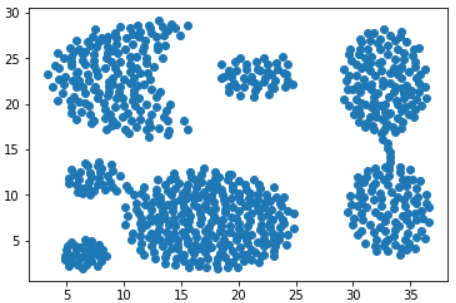
	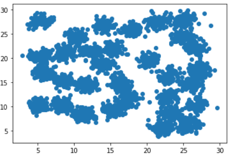
	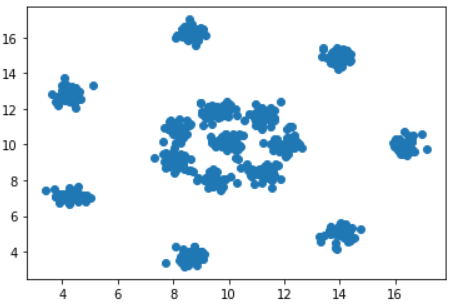
</center>

### 2. 数据预处理

对读取到的每个数据集进行归一化操作：

```python
dataset_agg = np.array((df_agg - df_agg.min()) / (df_agg.max() - df_agg.min()))
dataset_d31 = np.array((df_d31 - df_d31.min()) / (df_d31.max() - df_d31.min()))
dataset_r15 = np.array((df_r15 - df_r15.min()) / (df_r15.max() - df_r15.min()))
```

### 3. 模型训练

因为经过了数据预处理操作，对所有数据集使用 $d_c=0.05$ 就可以很好的将数据集相似性控制在 $2\%$ 的水平。然后对每个数据集都采用了两种训练方法：即选择前 `cluster_num` 个较高 $\gamma$ 的数据点作为聚类中心以及选择具有较高 $\rho$ 和较大 $\delta$ 的数据点作为聚类中心。

```python
model_agg.fit(dataset_agg, cluster_num=7)
model_d31.fit(dataset_d31, cluster_num=31)
model_r15.fit(dataset_r15, cluster_num=15)

model2_agg.fit(dataset_agg, cluster_num=None, rho=13, delta=0.2)
model2_d31.fit(dataset_d31, cluster_num=None, rho=65, delta=0.08)
model2_r15.fit(dataset_r15, cluster_num=None, rho=33, delta=0.08)
```

## 实验结果

对 `arrgegation.txt` 数据集的可视化结果：

- 使用 `cluster_num`

<center class="half">
    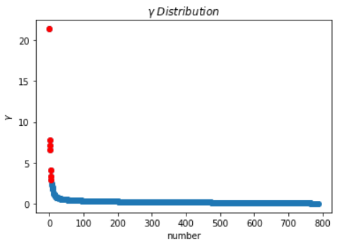
	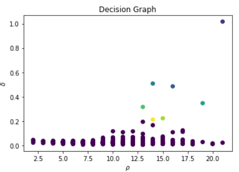
	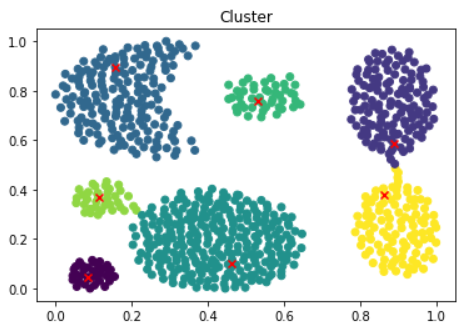
</center>


- 使用 $\rho$ 和 $\delta$ 阈值

<center class="half">
    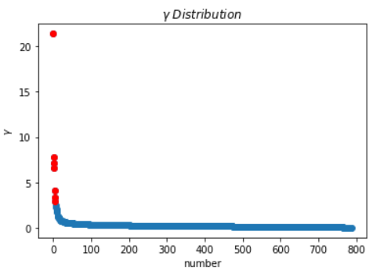
	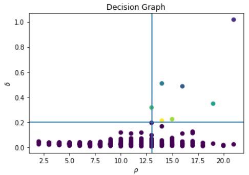
	
</center>


对 `d31.txt` 数据集的可视化结果：

- 使用 `cluster_num`

<center class="half">
    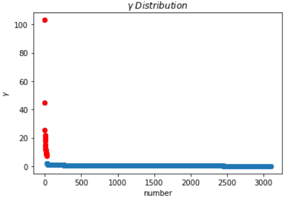
	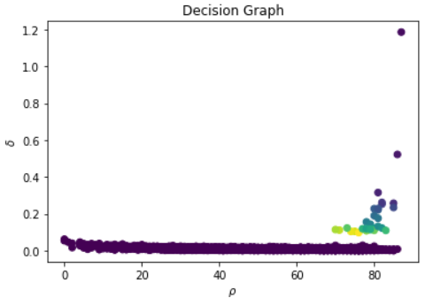
	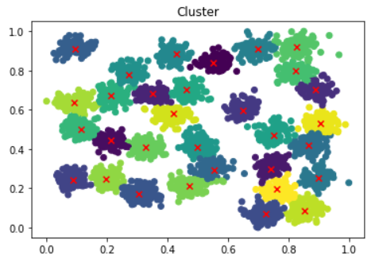
</center>


- 使用 $\rho$ 和 $\delta$ 阈值

<center class="half">
    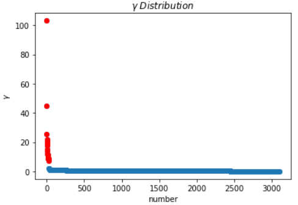
	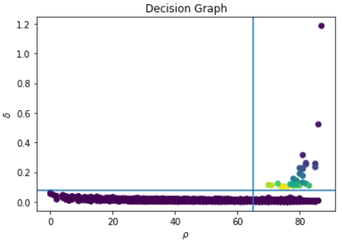
	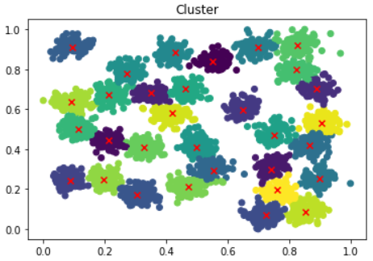
</center>


对 `r15.txt` 数据集的可视化结果：

- 使用 `cluster_num`

<center class="half">
    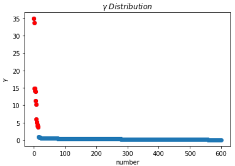
	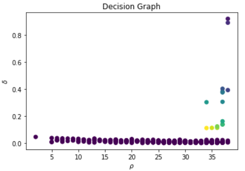
	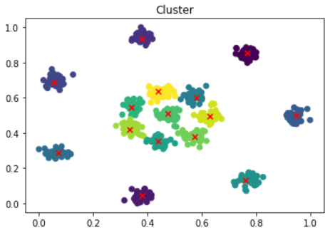
</center>


- 使用 $\rho$ 和 $\delta$ 阈值

<center class="half">
    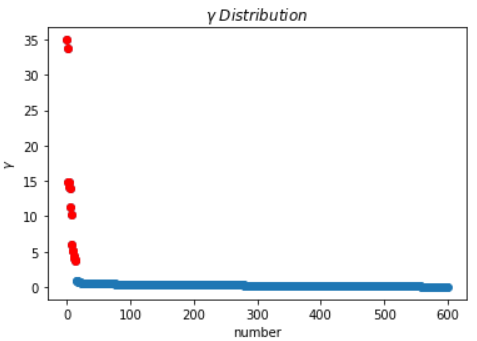
	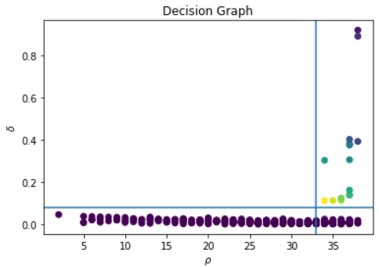
	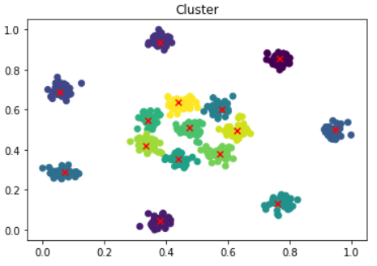
</center>


这三个数据集计算出来的 DBI 指数的值为（两种训练方法都一样）：

|      |  arrgegation.txt  |      d31.txt       |       r15.txt       |
| :--: | :---------------: | :----------------: | :-----------------: |
| DBI  | 0.506748058104934 | 0.5528666031397756 | 0.31481596929442923 |

## 实验分析

DPC 算法最终得到的聚类效果很好，且算法本身比较简单，且其时间复杂并不是很高，其主要的时间开销在于计算数据集中两两数据之间的距离。通过人为的选择 `cluster_num` （虽然 DPC 算法无需这样做，但是这样做会更加简单）或者根据决策图来选择 $\rho$ 和 $\delta$ 阈值就可以达到非常好的效果。并且，还可以设置其它 $\rho$ 和 $\delta$ 阈值来找出 OOD 数据点，在本次实验中，由于没有明显的 OOD 数据点，所以没有什么必要做，且也不太好验证（当然选取 OOD 数据点也十分方便，只要根据决策图来选择 $\rho$ 和 $\delta$ 阈值即可找到）。总之，个人认为 DPC 算法是一个简单且高效的聚类算法。
