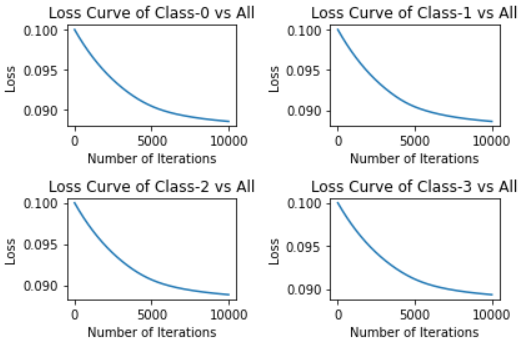

# Lab5 实验报告

PB20111689 蓝俊玮			实验环境： Google Colab

[TOC]

## 实验原理

### Relief-F

Relief-F 能处理多分类问题。假定数据集 $D$ 中的样本来自 $|\mathcal{Y}|$ 个类别，对示例 $\pmb{x}_i$，若它属于第 $k$ 类，则 Relief-F 先在第 $k$ 类的样本中寻找 $x_i$ 的最近邻示例 $\pmb{x}_{i,nh}$ 并将其作为猜中近邻，然后在第 $k$ 类之外的每个类中找到一个 $\pmb{x}_i$ 的最近邻示例作为猜错近邻，记为 $\pmb{x}_{i,l,nm}$，于是，相关统计量对应于属性 $j$ 的分量为：
$$
\sigma^j=\sum_i-\operatorname{diff}(x_i^j,x_{i,nm}^j)^2+\sum_{l\ne k}(p_l\times\operatorname{diff}(x_i^j,x_{i,l,nm}^j)^2)
$$
通过相关统计量就可以度量特征的重要性。

### LASSO

LASSO 的目标优化函数就是：
$$
\min_{\pmb{w}}\sum_{i=1}^m(y_i-\pmb{w}^T\pmb{x}_i)^2+\lambda||\pmb{w}||^2_2
$$
LASSO 可以解决高维数据的稀疏性问题。在高维数据中，可能有很多特征是不重要的，系数很小。采用 LASSO 方法，就可以把这些不重要的特征压缩为 $0$，这样既实现了较为准确的参数估计，也实现了变量选择。当 $\pmb{w}$ 取得稀疏解意味着初始的 $d$ 个特征中仅有对应着 $\pmb{w}$ 的非零分量的特征才会被提取出来。

### Random Forest

Random Forest 是以决策树为基学习器构建 Bagging 集成的基础上，进一步在决策树的训练过程中引入了随机属性选择。在随机森林的学习过程中，同时也会对特征的重要性进行学习。因此也可以利用随机森林的特征重要性来特征选择工作。

### Linear Discriminant Analysis

在多分类学习任务当中，假定存在 $N$ 个类，且第 $i$ 类示例数为 $m_i$，则全局散度矩阵可以定义为：
$$
\begin{align}
S_t=&\ S_b+S_w\\
=&\ \sum_{i=1}^m(x_i-\mu)(x_i-\mu)^T
\end{align}
$$
其中 $\mu$ 是所有示例的均值向量。将类内散度矩阵 $S_w$ 重定义为每个类别的散度矩阵之和，即：
$$
S_w=\sum_{i=1}^NS_{w_i}\\
S_{w_i}=\sum_{x\in X_i}(x-\mu_i)(x-\mu_i)^T
$$
由上式可得：
$$
\begin{align}
S_b=&\ S_t-S_w\\
=&\ \sum_{i=1}^Nm_i(\mu_i-\mu)(\mu-\mu_i)^T
\end{align}
$$
则通过对上述变量进行优化，多分类 LDA 可以将样本投影到 $d'$ 维空间，$d'$ 通常远小于数据原有的特征数 $d$。于是，可以通过这个投影来减小样本点的维数，且投影过程中使用了类别信息。

### OneVsAll

一对多是一种涉及训练 $N$ 个不同的二元分类器的策略，每个分类器都被设计用于识别特定的类。在训练时，每次将一个类的样例作为正例、所有其他类的样例作为反例来训练 $N$ 个分类器。训练结束之后，考虑每个分类器的预测置信度，选择置信度最大的类别标记作为分类结果。本次实验中，我为每个训练器都分配了一个权重 $\theta$，以字典的形式为每个类别 $c$ 都存储了一个权重 $\theta$。

#### Logistics Regression

二元逻辑斯蒂回归模型是如下的条件概率分布：
$$
P(Y=1|x)=\frac{\exp(w\cdot x+b)}{1+\exp(w\cdot x+b)}\\
P(Y=0|x)=\frac{1}{1+\exp(w\cdot x+b)}
$$
逻辑斯蒂回归比较两个条件概率值得大小，将实例 $x$ 分到概率值较大的那一类。逻辑斯蒂回归模型学习时，可以应用极大似然估计法估计模型参数，则对数似然函数为：
$$
L(w)=\sum_{i=1}^N\bigg[y_i\log P(Y=1|x_i)+(1-y_i)\log P(Y=0|x_i)\bigg]
$$
然后对该目标函数进行梯度下降法进行优化。

这里采用 OneVsAll 之后，首先将数据集按照类别进行划分为正类和负类，然后为每个分类器都分配一个权重 $\theta$，根据该权重进行梯度下降法训练，将最终训练后的参数 $\theta$ 与类别 $c$ 一起存储到 `self.thetas ` 中。代码总体上和 Lab1 是一致的。

```python
def fit(self, X, y):
    X = np.insert(X, 0, 1, axis=1)	# 添加 Bias
    y = np.expand_dims(y, axis=1)
    for i in np.unique(y):	# np.unique(y) 会得到每个类，然后对每个类进行一次训练
        y_ova = np.where(y == i, 1, 0)	# 将类划分为正类和负类
        theta = np.zeros((X.shape[1], 1))	# 初始化权重
        loss = []
        for iteration in range(int(self.max_iter)):
            p = self.sigmoid(np.dot(X, theta))
            if self.penalty == 'l2':	# l2 优化
                grad = -(np.dot(X.T, y_ova - p) + theta) / len(y_ova)	# 梯度
            elif self.penalty == 'l1':	# l1 优化
                l1 = np.ones_like(theta)
                l1[np.where(theta < 0)] = 0
                grad = -(np.dot(X.T, y_ova - p) + l1) / len(y_ova)	# 梯度
            los = 1 / len(y_ova) * np.sum(-y_ova.T.dot(np.log(p)) - (1 - y_ova).T.dot(np.log(1 - p)))
            loss.append(los)
            if (np.absolute(grad) < self.tol).all():
                break
            theta = theta - self.lr * grad  	# 梯度下降
        self.thetas.append((theta, i))
        self.train_loss.append((loss, i))
```

在预测的时候，将实例 $x$ 分到概率值较大的那一类。这里将数据在分类器中都预测一次，然后选择概率值最大的那个类别，作为该数据的类别。

```python
def predict(self, X):
    X = np.insert(X, 0, 1, axis=1)
    pred = [max((self.sigmoid(np.dot(i, theta)), c) for theta, c in self.thetas)[1] for i in X]
    return pred
```

#### Support Vector Machine

支持向量机采用合页损失函数后，可以得到目标优化函数为：
$$
L(w)=\frac{1}{2}C_1||w||^2+C_2\sum_{i=1}^n\max(0,1-y_i(w\cdot x_i+b))
$$
然后对该目标函数进行梯度下降法进行优化。

这里采用 OneVsAll 之后，首先将数据集按照类别进行划分为正类和负类，然后为每个分类器都分配一个权重 $\theta$，根据该权重进行梯度下降法训练，将最终训练后的参数 $\theta$ 与类别 $c$ 一起存储到 `self.thetas ` 中。代码总体上 Lab2 是一致的。

```python
def fit(self, X, y):
    X = np.insert(X, 0, 1, axis=1)	# 添加 Bias
    y = np.expand_dims(y, axis=1)
    for i in np.unique(y):	# np.unique(y) 会得到每个类，然后对每个类进行一次训练
        y_ova = np.where(y == i, 1, 0)	# 将类划分为正类和负类
        theta = np.zeros((X.shape[1], 1))	# 初始化权重
        loss = []
        for iteration in range(int(self.max_iter)):
            z = y_ova * np.dot(X, theta)
            hinge = np.maximum(0, 1 - z)
            hinge_grad = -y_ova * X * self.C2	# 合页损失函数
            hinge_grad[np.where(hinge == 0)[0]] = 0
            hinge_grad = np.sum(hinge_grad, axis=0)
            grad = hinge_grad.reshape((-1, 1)) + self.C1 * theta	# 梯度
            hinge_loss = np.sum(hinge) * self.C2
            los = self.C1 * 0.5 * np.linalg.norm(theta) + hinge_loss
            loss.append(los)
            if (np.absolute(grad) < self.tol).all():
                break
            theta = theta - self.lr * grad	# 梯度下降
        self.thetas.append((theta, i))
        self.train_loss.append((loss, i))
```

在预测的时候，由于 SVM 的预测函数是以决策函数 `sign` 来决定的，因此我们将实例 $x$ 分到与边界距离最远的那个一类中。这里将数据在分类器中都预测一次，然后选择与边界距离最大的那个类别，作为该数据的类别。

```python
def predict(self, X):
    X = np.insert(X, 0, 1, axis=1)
    pred = [max((np.abs(np.dot(i, theta) + 1), c) for theta, c in self.thetas)[1] for i in X]
    return pred
```

### Friedman

Friedman 检验可以再一组数据集上对多个算法进行比较。当有多个算法参与比较时，Friedman 基于算法排序来判断这些算法是否性能都相同。若相同，则它们的平均序值应当相同。假定在 $N$ 个数据集上比较 $k$ 个算法，令 $r_i$ 表示第 $i$ 个算法的平均序值。则变量：
$$
\tau_{\chi^2}=\frac{12N}{k(k+1)}\bigg(\sum_{i=1}^kr_i^2-\frac{k(k+1)^2}{4}\bigg)
$$
但是现在通常使用变量：
$$
\tau_F=\frac{(N-1)\tau_{\chi^2}}{N(k-1)-\tau_{\chi^2}}
$$
则 $\tau_F$ 服从自由度为 $k-1$ 和 $(k-1)(N-1)$ 的 F 分布。

### Nemenyi

Nemenyi 检验是一种后续检验，旨在找出在全局统计检验（例如 Friedman 检验）拒绝零假设后不同的数据组。该检验对性能进行成对检验。Nemenyi 检验计算出平均序值差别的临界值域：
$$
CD=q_\alpha\sqrt{\frac{k(k+1)}{6N}}
$$

若两个算法的平均序值之差超出了临界值域 $CD$，则以相应的置信度拒绝“两个算法性能相同”这一假设。

## 实验步骤

### 1. 数据读取

```python
df_train_dataset = pd.read_csv("train_feature.csv")
df_train_label = pd.read_csv("train_label.csv")
df_test_dataset = pd.read_csv("test_feature.csv")
```

查看训练集的信息之后可以发现，存在空缺值和离群数据，因此我们需要对这两个问题进行处理：

空缺值的处理方式：

- 直接将含有空缺值的数据去除（这样做会使得数据集规模变小）

- 用平均值替换空缺值（这样可以保留原有的数据集规模）

离群数据的处理方式：

- 采用箱线图（这里使用了 `boxplot()` 包来得到箱线图的信息）来确认离群数据，并且再确认之后用缺失值替换离群数据（目的也是为了保留原有的数据集规模）

并且从文档中知，数据集中可能存在大量冗余随机特征，因此我们需要去除冗余的特征数据：

- 将冗余的特征数据删除

同时因为数据集的维数过大，我们要做一定的特征提取工作。特征提取工作大致可以分为这些方法：

- 过滤式选择：Relief-F（这里使用了 `from skrebate import ReliefF`）
- 嵌入式选择：LASSO（这里使用了 `from sklearn.linear_model import LassoCV`）
- 其它选择方式：f_classif，mutual_info，Random Forest，LDA（在这里都使用了 sklearn 的包，目的都是调用相应的功能来进行特征选取。）

### 2. 数据预处理

因为数据预处理的方式有很多种，所以我只展示预处理效果最好的 LDA 处理方式。对数据集进行去除离群点，填补空值，标准化，以及特征筛选：

```python
ds = dataset_drop_outlier(df_train_dataset)	# 去除离群点
ds = dataset_drop_duplicate(ds)	# 去除重复数据
ds = dataset_replace_null(ds)	# 用平均值填补空值
ds = dataset_norm(ds, method='z-score')	# 用 z-score 的方式标准化数据集
ds = dataset_select_features(ds, df_train_label, method='lda')	# 用 LDA 进行特征提取
```

- 去除离群点采用的方法是：箱线图（`boxplot()`）。箱线图是一个能够通过 $5$ 个数字来描述数据的分布的标准方式，这 $5$ 个数字包括：最小值，第一分位，中位数，第三分位数，最大值。箱线图能够明确的展示离群点的信息，同时能够让我们了解数据是否对称，数据如何分组、数据的峰度。箱线图判断离群点的标准以四分位数和四分位距为基础，四分位数具有一定的耐抗性，多达 $25\%$ 的数据可以变得任意远而不会很大地扰动四分位数。所以离群点不会影响箱形图的数据形状，箱线图识别离群点的结果比较客观。由此可见，箱线图在识别离群点方面有一定的优越性。在找到离群点后，我们用 NaN 来替换。
- 去除重复数据采用的方法是：pandas 的 `drop_duplicates()`，这个函数仅仅是去除重复数据而已。不过在本实验中的数据集中，并没有重复的数据。
- 处理空值 NaN 的方式是使用当前特征的平均值进行填补，相较于去除这些含有空值的数据来说，这样做的好处是能够保持数据集的规模，不会因为去除空值而损失大量的数据集。
- 标准化的方式是使用 Z-Score，因为在数据集中，不同特征的量级相差较大，因此我们需要一个较统一的范围来进行学习。Z-Score 的主要目的就是将不同量级的数据统一转化为同一个量级，统一用计算出的 Z-Score 值衡量，以保证数据之间的可比性。
- 特征提取的方式是采用 LDA（`from sklearn.discriminant_analysis import LinearDiscriminantAnalysis as LDA`） 进行处理。LDA 将特征选择过程与学习器训练过程融为一体，二者在同一个优化过程中完成。相较于其它方法，LDA 在特征提取的时候使用了类别信息，因此它能够在训练的过程中学习到特征与类别的联系，因此效果肯定是会比直接分析特征更好。

### 3. 数据划分以及模型训练

数据划分（模型评估）采用的是留出法和交叉验证法。因为这个概念比较相近，所以我将这些过程融合在一起进行。

- 留出法是直接将数据集 $D$ 划分为两个互斥的集合，其中一个集合作为训练集 $S$，另一个作为测试集 $T$，即 $D=S\cup T,S\cap T=\empty$，在 $S$ 上训练出模型后，用 $T$ 来评估其测试误差，作为对泛化误差的估计。下述的 `dataset_split()` 是我自己实现的。

  ```python
  def holdout5_eval(estimator, X, y, model=None):
      """ 5次留出法训练并验证，并且绘制一次训练损失曲线
      :param estimator: 需要使用的算法
      :param X: 目标数据集
      :param y: 数据集标签
      :param model: 模型名称
      """
      # ......
      seeds = [1234, 2234, 3234, 4234, 5234]	# 通过不同随机种子得到不同的划分结果
      accuracys = []
  
      for seed in seeds:
          X_train, Y_train, X_test, Y_test = dataset_split(X, y, 0.8, seed)	# 留出法划分数据集
          train_model = copy.deepcopy(estimator)
          # ......
          train_model.fit(X_train, Y_train)			# 模型训练
          y_pred = train_model.predict(X_test)		# 模型预测
          accuracy = accuracy_score(Y_test, y_pred)	# 模型评估
          accuracys.append(accuracy)
      # ......
      print("holdout-model's average accuracy score is {}.".format(np.mean(accuracys)))
      return accuracys
  ```

- 交叉验证法将数据集划分为 $k$ 个大小相似的互斥子集，即 $D=D_1\cup D_2\cup...\cup D_k,D_i\cap D_j=\empty(i\ne j)$。每个子集 $D_i$ 都尽可能保持数据分布的一致性，即从 $D$ 中通过分层采样得到。然后每次用 $k-1$ 个子集的并集作为训练集，余下的子集作为测试集。这样就可以获得 $k$ 组训练/测试集，最终返回的是这 $k$ 个测试结果的均值。

  ```python
  def crossvalid5_eval(estimator, X, y, model=None):
      """ 5折交叉训练并验证
      :param estimator: 需要使用的算法
      :param X: 目标数据集
      :param y: 数据集标签
      :param model: 模型名称
      """
      # ......
      accuracys = []
      kf = KFold(n_splits=5, shuffle=True, random_state=3407)		# 交叉验证法划分数据集
      for train_index, test_index in kf.split(X):
          X_train, X_test = X.iloc[train_index], X.iloc[test_index]
          Y_train, Y_test = y.iloc[train_index], y.iloc[test_index]
          X_train, X_test = np.array(X_train), np.array(X_test)
          Y_train, Y_test = np.array(Y_train).flatten(), np.array(Y_test).flatten()
          train_model = copy.deepcopy(estimator)
          # ......
          train_model.fit(X_train, Y_train)			# 模型训练
          y_pred = train_model.predict(X_test)		# 模型预测
          accuracy = accuracy_score(Y_test, y_pred)	# 模型评估
          accuracys.append(accuracy)
      # ......
      print("cross validation-model's average accuracy score is {}.".format(np.mean(accuracys)))
      return accuracys
  ```

这部分操作与后续的模型调参一起进行，以方便对比调参前后的训练结果。

### 4. 模型调参

调参过程可通俗表述为：给定一组数据 $D$ 和具有可调 $N$ 个参数的算法，调参的目的就是在由参数组成的 $N$ 维向量集里，挑选一组参数 $\lambda$，使得算法在训练集学习后能在验证集取得最优的效果。本次实验中，我采用的方法是网格调参，网格调参通过循环遍历，尝试每一种参数组合，返回最好的得分值的参数组合。其有点就是简单容易实现，缺点就是需要考虑每一种参数组合，耗费的时间长。对于 sklearn 风格的模型，我使用了 `GridSearchCV()` 函数来进行调参。`GridSearchCV()` 函数采用了交叉验证的方式进行评估模型参数，相较于固定的验证集合，会有更准确的性能评估。而对于逻辑斯蒂回归模型和支持向量机模型，我都是采用类似网格搜索的方式，并且使用留出法来进行调参的。

```python
def get_best_param(estimator, X, y, params, silent):
    """ 获取最佳参数
    :param estimator: 模型
    :param X: 数据集
    :param y: 标签
    :param params: 参数列表
    :param silent: 是否输出信息
    """
    y = np.array(y).flatten()
    grid_search = GridSearchCV(estimator, params, cv=5, scoring='accuracy', n_jobs=1)
    grid_search.fit(X, y)
    scores = grid_search.cv_results_['mean_test_score']
    if not silent:
        plt.bar(range(len(scores)), scores)
    return grid_search.best_params_
```

在进行调参之前，我们使用每个模型的默认参数进行训练。然后训练之后，再选取一定的参数范围，进行网格搜索，得到最优的参数组合。因为参数搜索的训练时间很长，因此我只选择了一些我认为比较重要的参数进行搜索。下面是我选取的范围：

- Logistics Regression：

  ```python
  penaltys = ["l1", "l2"]
  lrs = [0.001, 0.005, 0.01, 0.015, 0.02, 0.025, 0.03, 0.035, 0.04]
  tols = [1e-5, 5e-5, 1e-4, 5e-4]
  ```
  
  得到最优结果：`('l1', 0.001, 1e-05)`

- XGBoost：

  ```python
  params = [{
      'min_child_weight': [1, 2, 3], 
      'max_depth': [3, 4, 5, 6, 7], 
      'learning_rate': [0.01, 0.05, 0.1, 0.15, 0.2], 
      'gamma': [1e-5, 1e-4, 1e-3]
  }]
  ```
  可以看到在参数搜索过程中的变化大，说明对于 XGBoost 来说，选择一个好的参数是十分重要的：
	
	
	
	得到最优结果：`{'gamma': 1e-05, 'learning_rate': 0.01, 'max_depth': 3, 'min_child_weight': 3}`
	
- Neural Network：

  ```python
  params = [{
      'hidden_layer_sizes': [(64, ), (100, ), (128, )], 
      'alpha': [0.0001, 0.0005, 0.001, 0.005, 0.01, 0.05], 
      'learning_rate_init': [0.001, 0.005, 0.01]
  }]
  ```
  可以看到在参数搜索过程中的变化起伏小，说明神经网络模型更加适用，不受参数太大影响，其学习能力比较强：

  

  得到最优结果：`{'alpha': 0.05, 'hidden_layer_sizes': (64,), 'learning_rate_init': 0.001}`

- Decision Tree：

  ```python
  params = [{
      'criterion': ['entropy', 'gini'], 
      'max_depth': [None, 2, 3, 4, 5, 6, 7], 
      'min_samples_split': [2, 3, 4, 5, 6], 
      'min_samples_leaf': [1, 2, 3, 4, 5]
  }]
  ```

  可以看到在参数搜索过程中的变化起伏大，说明对于决策树模型来说，调参是十分有必要的：

  

  得到最优结果：`{'criterion': 'gini', 'max_depth': 3, 'min_samples_leaf': 1, 'min_samples_split': 2}`

- Support Vector Machine：

  ```python
  C1s = [0.005, 0.01, 0.015, 0.02, 0.025, 0.03, 0.035, 0.04]
  C2s = [1e-5, 5e-5, 1e-4, 5e-4]
  lrs = [0.005, 0.01, 0.015, 0.02, 0.025, 0.03]
  ```
  
  得到最优结果：`(0.025, 1e-05, 0.01)`

每个模型使用默认参数和使用调参后的性能对比：

|     平均性能      | Logistics Regression | XGBoost | Neural Network | Decision Tree | Support Vector Machine |
| :---------------: | :------------------: | :-----: | :------------: | :-----------: | :--------------------: |
|  默认参数+留出法  |        0.3056        | 0.2952  |     0.3060     |    0.2568     |         0.3057         |
|  最优参数+留出法  |        0.3056        | 0.2989  |     0.3055     |    0.2959     |         0.3058         |
| 默认参数+交叉验证 |        0.3069        | 0.2981  |     0.3001     |    0.2644     |         0.3060         |
| 最优参数+交叉验证 |        0.3079        | 0.3016  |     0.3057     |    0.2943     |         0.3077         |

将其用图表绘制展现：


可以看出，经过调参后，模型的总体性能效果都会变得更好。

### 5. 其余特征选择结果

个人认为，本次实验中最重要的就应该是这个特征选取工作了。因为数据集中存在了大量无用的信息，且数据集的规模很大，因此很有必要进行特征选择，而特征选择的结果必然会影响到模型训练的结果。因此需要找到一个好的方法来进行特征选取。除了 LDA，我还分别采用 lasso，f_classif，mutual_info，random forest，relief-f 方式进行数据的特征选择工作，然后采用决策树模型并且使用上述得到的最优参数来预测（这里选择决策树模型的原因是其训练快）。可以得到其性能评估：

|  平均性能  | lasso  | f_classif | mutual_info | random forest | relief-f |  LDA   |
| :--------: | :----: | :-------: | :---------: | :-----------: | :------: | :----: |
|   留出法   | 0.2500 |  0.2503   |   0.2557    |    0.2428     |  0.2504  | 0.2959 |
| 交叉验证法 | 0.2539 |  0.2436   |   0.2462    |    0.2291     |  0.2422  | 0.2943 |

### 6. 假设检验操作

通过数据预处理的不同方式，可以认为得到了不同的数据集，因为 LDA 会对数据集进行投影，而不是简单的特征筛选提取。则在不同的数据集上可以得到如下结果：

| 平均性能 | Logistics Regression | XGBoost | Neural Network | Decision Tree | Support Vector Machine |
| :------: | :------------------: | :-----: | :------------: | :-----------: | :--------------------: |
|  $D_1$   |        0.3056        | 0.2989  |     0.3055     |    0.2959     |         0.3058         |
|  $D_2$   |        0.2748        | 0.2643  |     0.2624     |    0.2608     |         0.2751         |
|  $D_3$   |        0.2748        | 0.2651  |     0.2683     |    0.2637     |         0.2744         |

其中 $D_1$ 是直接用 LDA 操作得到的数据集，而 $D_2$ 是先使用 mutual_info 后再进行 LDA 得到的数据集，而 $D_3$ 是先使用 random forest 后再进行 LDA 得到的数据集。

## 实验分析

可以看出，除了 LDA 方式，其它方式的结果并不好，这些方法并没有学习到特征和标签之间的关系。原因可能是因为无用特征之间相互作用，导致了这些方法没能够有效的将无用的特征筛选出去。并且可能某些无用特征的分布和真实特征的分布是相同的，导致这些通过特征重要性来选择特征的方法就起不到好的作用，因为它无法区分这些同分布的特征哪一个是更重要的。而对于 LDA 方式，我们知道它是将训练数据进行投影映射，使同类样例的投影点尽可能接近，异类样例的投影点尽可能远离。通过这种方法，它就会缩小由于分布采样带来的方差，因为它的约束条件不是很强，只需要“尽可能”就可以达到目的。而且还可以利用与真实特征相同分布的无用特征来进行投影，所以其学习效果会比较好。

原本想通过上述其它方法先挑选出一些比较重要的特征，然后再进行 LDA 转化，但是结果发现这样做的效果也不是很好。原因可能是因为通过提取出了一些特征之后，然后就无法利用一些其它有用但是被筛选除去的信息，所以在无法确定有效特征的时候，对数据进行较大清洗会损失很多信息。但是通过这样的方式，还是能学习到一些有用的信息：

| 平均性能（mutual_info+LDA） | Logistics Regression | XGBoost | Neural Network | Decision Tree | Support Vector Machine |
| :-------------------------: | :------------------: | :-----: | :------------: | :-----------: | :--------------------: |
|           留出法            |        0.2748        | 0.2643  |     0.2624     |    0.2608     |         0.2751         |
|         交叉验证法          |          -           |    -    |       -        |    0.2603     |           -            |

而对数据集进一步的进行分析，很多浮点数小数点后面都有很多位数，很像是随机生成的数据。而只有其中的 feature_28，feature_50，feature_69，feature_92，feature_107 是只有一位小数的，这些数据看起来比较真实。对于整型类型的数据，很多都是服从正态分布的，像是从正态分布上采样得到的，看起来也像是随机生成的。而对于其它特征，暂时也没有什么实质性的发现。

而对于模型来说，其实在充分调参后， $5$ 个模型的表现性能接近。而 XGBoost 和 Decision Tree 的表现性能可能会稍微差一点。个人认为可能是因为它们都以决策树为基学习器。原因可能是因为决策树的本质是根据选取特征来划分子树，而在本实验中存在大量的无用特征，这些特征难免会影响到决策树的划分。而其它模型的学习效果都不错。

## 假设检验

根据实验中的操作，可以得到一个算法比较序值表（基于留出法的比较）：

|    数据集    | Logistics Regression |    XGBoost     | Neural Network | Decision Tree  | Support Vector Machine |
| :----------: | :------------------: | :------------: | :------------: | :------------: | :--------------------: |
|    $D_1$     |    0.3056 **(2)**    | 0.2989 **(4)** | 0.3055 **(3)** | 0.2959 **(5)** |     0.3058 **(1)**     |
|    $D_2$     |    0.2748 **(2)**    | 0.2643 **(3)** | 0.2624 **(4)** | 0.2608 **(5)** |     0.2751 **(1)**     |
|    $D_3$     |    0.2748 **(1)**    | 0.2651 **(4)** | 0.2683 **(3)** | 0.2637 **(5)** |     0.2744 **(2)**     |
| **平均序值** |      **1.6667**      |   **3.6667**   |   **3.3333**   |     **5**      |       **1.3333**       |

则计算变量：
$$
\begin{align}
\tau_{\chi^2}=&\ \frac{12N}{k(k+1)}(\sum_{i=1}^kr_i^2-\frac{k(k+1)^2}{4})\\
=&\ \frac{12\times3}{5\times6}\bigg((\frac{5}{3})^2+(\frac{11}{3})^2+(\frac{10}{3})^2+5^2+(\frac{4}{3})^2-\frac{5\times6^2}{4}\bigg)\\
=&\ \frac{164}{15}\approx 10.93
\end{align}
$$
接着计算变量：
$$
\begin{align}
\tau_F=&\ \frac{(N-1)\tau_{\chi^2}}{N(k-1)-\tau_{\chi^2}}\\
=&\ \frac{(3-1)\times10.93}{3\times(5-1)-10.93}=20.5
\end{align}
$$
而 $\tau_F$ 是服从自由度为 $4$ 和 $8$ 的 F 分布。查表可以得到 $\alpha=0.005$ 时的值为 $8.81$。那么，有 $99.5\%$ 的把握认为所有的算法性能是不相同的，因此拒绝假设“所有算法的性能相同”。接下来就使用 Nemenyi 后续检验来区分逻辑斯蒂回归模型和支持向量机模型。

计算临界值域（当 $\alpha=0.05$ 时）：
$$
CD=q_{\alpha}\sqrt{\frac{k(k+1)}{6N}}=2.459\times\sqrt{\frac{5\times6}{6\times3}}\approx3.175
$$
那么就有 $95\%$ 的把握认为逻辑斯蒂回归模型和支持向量机模型的性能没有显著差别。而有 $95\%$ 的把握认为逻辑斯蒂回归和支持向量机模型与决策树模型的性能有显著差别。而其余的模型都可以认为没有显著差别。

## 模型选择

从上述的总体性能看来，最后的模型我选择 SVM 来预测测试集。在使用预测测试集时，同样地，也需要对其进行相同的数据预处理。

```python
ds_test = dataset_drop_outlier(df_test_dataset)	# 去除离群点
ds_test = dataset_drop_duplicate(ds_test)	# 去除重复数据
ds_test = dataset_replace_null(ds_test)		# 用平均值填补空值
ds_test = dataset_norm(ds_test, method='z-score')	# 用 z-score 的方式标准化数据集

lda_model = LDA(n_components=3)
lda_model.fit(ds, np.array(df_train_label).flatten())	# 利用训练集的信息
ds_test_lda = lda_model.transform(np.array(ds_test))	# 对预测测试集进行特征提取
```

并且采用整个训练集对 SVM 模型进行训练。通过学习整个训练集的信息来预测最终的标签。同时这个最后的模型在整个训练集上训练的效果如下：



## 实验总结

本次实验考察的知识点很广，从数据预处理到调参到假设检验都有涉及。本次实验最大的困难就是如何从训练数据集中挖掘出有效的特征来进行训练。在尝试过多种特征提取的方式后，可以看出 LDA 的提取效果最好。同时在调参的过程中，也能发现不同参数对模型训练有很大影响。最后通过假设检验也可以得知，其实模型之间训练结果的差距并不是很大，即性能表现不取决于某一类学习器，如何从数据集中提取或者学习到有效信息才是最重要的。通过本次实验中一次完整的机器学习流程，真的让我受益匪浅。
